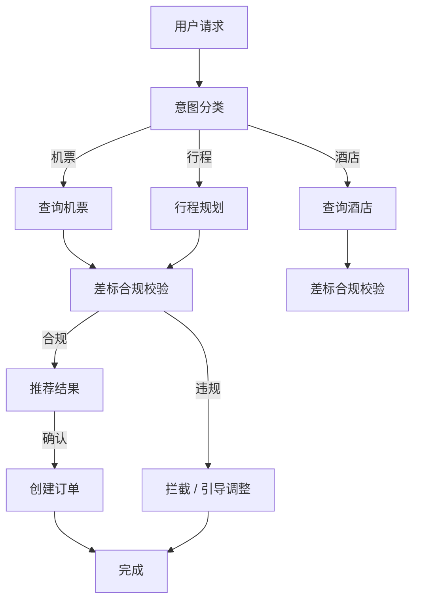
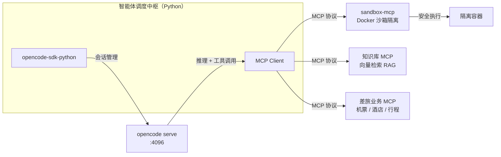
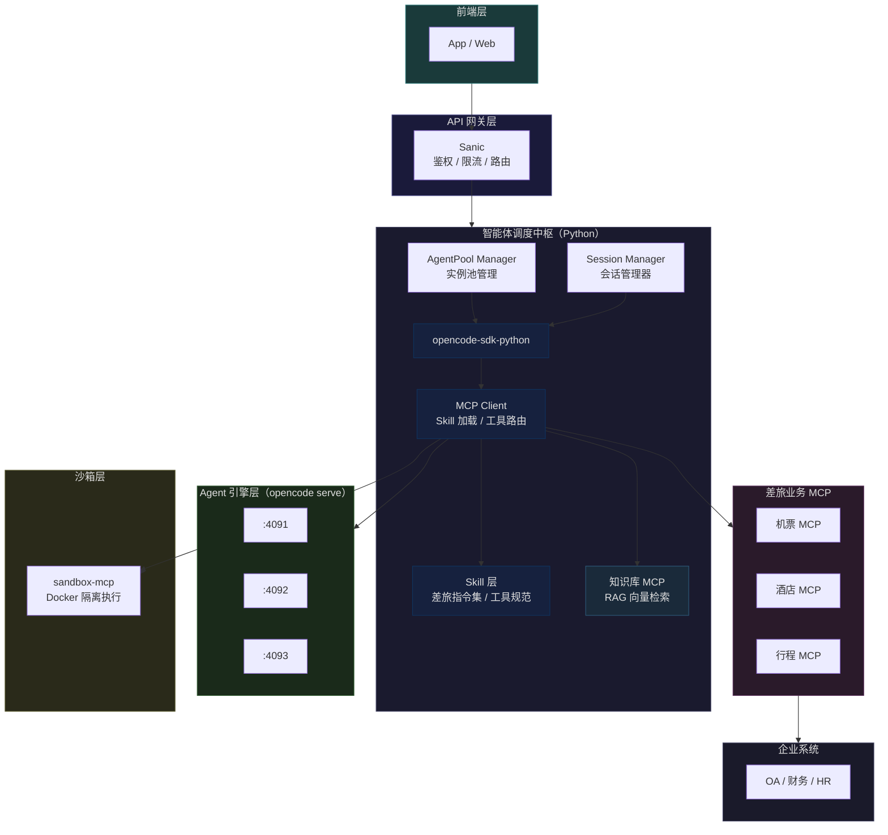

# 基于 OpenCode 智能体引擎的调度中枢技术方案

> **文档版本**：v1.0
> **编制日期**：2026年5月28日
> **文档用途**：技术方案评审

---

## 一、项目背景

### 1.1 为什么自建调度层

AI Agent 技术迭代迅速，从 ReAct 循环到 Tool Call，从状态机到多 Agent 协作，范式不断演进。站在企业长期发展角度，需要考虑：

#### 自研编排的长期成本

- **技术迭代风险**：AI Agent 领域发展迅猛，自研方案难以持续跟进最新进展，容易在技术迭代中掉队
- **维护负担重**：状态图、意图分类、多轮上下文管理等工程问题复杂度高，从零解决需要大量人力
- **人员依赖风险**：核心逻辑一旦形成人员依赖，技术债务积累，难以交接和维护
- **重复造轮子**：session 管理、并发控制、断线重连等工程问题业界已有成熟解决方案

#### 使用成熟开源 Agent 引擎

- **专注业务**：调度层只做编排，Agent 核心能力交给成熟开源项目，团队聚焦差旅业务本身
- **社区红利**：开源社区推动技术演进，新特性、新优化自动享受，无需自己跟进
- **稳定可靠**：官方 SDK 维护，API 稳定性有保障，兼容性问题由社区负责
- **透明可审计**：代码透明，满足企业合规要求，可自行审计和修改

**核心思路：站在成熟开源肩膀上，专注差旅业务深度定制，而非重复造轮子。**

### 1.2 Agent 驱动的工具调度：最新 AI 发展范式

当前 AI Agent 技术已从"预设流程"演进到"**Agent 自主调度工具**"的范式：

#### 行业趋势：从状态机到 Tool/Skill Harness

| 时代 | 范式 | 代表技术 | 特点 |
|------|------|----------|------|
| 早期 | 预设流程 | 规则引擎、对话树 | 人工穷举所有路径 |
| 中期 | 状态机编排 | LangGraph、Spring AI Graph | 预设节点和转移条件 |
| 当前 | Agent 自主调度 | OpenAI Tool Use、Anthropic MCP、OpenCode Skill | **Agent 根据上下文动态决定调用哪个工具** |

#### 核心概念：Harness 范式

> **Harness（驾驭）**：不是让 AI 去适应预定的流程，而是让 Agent 自主决定何时调用什么工具。

**这不是新概念，而是行业共识：**

- **OpenAI** 在 GPT-4 中推出 Function Calling / Tool Use，让模型自主决定调用外部工具
- **Anthropic** 发布 MCP（Model Context Protocol），定义 Agent 与外部工具的标准协议
- **OpenCode** 实现 Skill 机制，Agent 可按需加载业务规则描述文件
- **OpenAI Agents SDK**、**LangChain Agents** 等主流框架均围绕"Agent 自主调度"设计

**本质区别：**

```
状态机：用户 → [预设意图分类] → [预设节点A] → [预设节点B] → 结束
        每一步都是固定的，AI 只是执行预设路径

Agent Harness：用户 → Agent 理解意图 → Agent 自主选择工具 → 动态执行 → 反馈
                AI 理解目标，自主决定用什么工具达成目标
```

#### 为什么这更适合差旅场景

- **用户意图模糊**："帮我安排下周的行程"——Agent 自主拆解为目标并调用工具，而非预设路径
- **业务规则变化频繁**：差标、航司政策时常变化——更新 Skill 描述即可，Agent 自动适应
- **多工具协同**：机票、酒店、火车可能组合——Agent 根据上下文自主选择和组合工具

**结论：让 Agent 驾驭工具（Tool/Skill Harness），而非被预设流程束缚，是 AI Native 时代的正确姿势。**

### 1.3 业务流程定义：Skill 描述式 vs 状态图代码式

在差旅预订等业务流程开发上，两种方式差异显著：

#### 状态图代码开发

- 每个业务流程需工程师画图、编码、测试，周期长
- 新增航司或酒店品牌 → 修改图结构 + 重新发版
- 退改签规则变化 → 找到对应节点，改代码，回归测试
- 业务人员无法参与规则定义，只能提需求给工程师
- 意图分类节点出错 → 后续全错，召回率低

#### Skill 描述式开发

- 业务规则以 Markdown 文档定义，接近自然语言，业务人员可直接参与编写
- 新增航司 → 编写或更新 SKILL.md，Agent 自动理解并执行
- 差标调整 → 更新 Skill 描述，无需改代码和发版，热加载生效
- Agent 自主理解模糊意图，无需预设分类节点
- 以"查询北京到上海航班"为例：状态图需要预设意图分类 → 节点A → 节点B；Skill 只需描述"当用户需要订机票时，使用 search_flights 工具"

### 1.4 解决方案概述

本方案提出构建**私有化智能体调度中枢**，核心技术选型如下：

- **智能体引擎**：采用 OpenCode（开源、活跃维护、支持本地/服务器部署）
- **SDK 调度层**：采用官方 opencode-sdk-python（Python 3.8+，同步/异步双模式）
- **部署方式**：完全私有化，数据不出域，部署于本地或企业服务器

---

## 二、Agent 引擎方案比选

### 2.1 候选引擎一览

| 引擎 | 开发商 | 许可证 | Python SDK | 部署模式 | 通信方式 |
|------|--------|--------|------------|----------|----------|
| **OpenCode** | anomalyco / SST | 专有 + 开源组件 | ✅ 官方（opencode-sdk-python） | 本地 / 服务器 | **HTTP REST** |
| **Claude Code** | Anthropic | 专有 | ✅ 官方（@anthropic-ai/claude-agent-sdk） | 需云端 API Key | 进程调用（本地 CLI） |
| **Qwen Code** | 阿里云 / QwenLM | 开源（Apache 2.0） | ✅ 官方（qwen-code-sdk） | 本地 CLI + 云端 API | **进程传输**（stdio） |
| **Hermes Agent** | Nous Research | 开源（MIT） | ⚠️ 非官方（社区封装） | 本地 / Docker / SSH / Modal / Daytona | MCP 原生 + CLI |

---

### 2.2 详细对比

#### （1）Claude Code（Anthropic）

Claude Code 是 Anthropic 官方推出的 AI 编程助手，其 Agent SDK 提供 Python / TypeScript 双语言版本。

**核心特点**：

- SDK 通过启动本地 Claude Code 子进程工作（bundled binary），不依赖云端 CLI 安装
- 支持 `query()` 单次调用和 `ClaudeSDKClient` 持久会话两种模式
- 原生支持 MCP（Model Context Protocol）工具调用
- 沙箱执行：内置安全隔离环境，可配置资源限制（CPU / 内存 / 磁盘）
- 消息类型丰富：SystemMessage / AssistantMessage / ResultMessage / PartialMessage 等

**局限性**：
- ❌ SDK 本质是调用本地 bundled binary，非独立引擎，调度层难以远程调用

```python
# Claude Code SDK 用法
from claude_agent_sdk import query, ClaudeAgentOptions

async for message in query(
    prompt="Review utils.py for bugs",
    options=ClaudeAgentOptions(
        allowed_tools=["Read", "Edit", "Glob"],
        permission_mode="acceptEdits",
    ),
):
    if isinstance(message, AssistantMessage):
        print(message.content)
```

---

#### （2）Qwen Code（阿里云）

Qwen Code 是阿里巴巴通义千问团队开源的终端 AI 智能体（Apache 2.0），基于 Qwen3-Coder 系列模型优化。

**核心特点**：

- 完全开源，框架和模型均可自托管
- 支持多种模型提供商：阿里云百炼、OpenRouter、Fireworks AI、自带 API Key
- 多语言 SDK：Python / TypeScript / Java（官方）
- 支持 SubAgent 子代理并行任务，可多轮对话续 session
- 进程传输（v1）：通过 stdio 与本地 qwen CLI 通信

**局限性**：
- ❌ 进程传输方式限制了远程调度能力（stdio 只能在本地调用）

```python
# Qwen Code SDK 用法
from qwen_code_sdk import query, QueryOptions

async for message in query(
    prompt="分析这段代码",
    options=QueryOptions(
        model="qwen3.5-plus",
        allowed_tools=["Read", "Bash"],
        permission_mode="accept",
    ),
):
    print(message)
```

---

#### （3）Hermes Agent（Nous Research）

Hermes Agent 是 Nous Research 于 2026 年 2 月发布的开源自治智能体（MIT 许可证），定位为"可成长的个人服务器 Agent"。

**核心特点**：

- 极为活跃的开发节奏（7 次发布 / 27 天），增长迅猛
- 支持 6 种部署后端：本地、Docker、SSH、Singularity、Modal、Daytona（Serverless）
- 多平台消息网关：一个进程同时接入 Telegram / Discord / Slack / WhatsApp / Signal / Email
- MCP 原生集成（非后期适配）：所有工具均支持 MCP 协议
- 自动技能创建：Agent 完成任务后自动生成可复用 Skill 文档
- 内置 Cron 调度：自然语言配置定时自动化任务
- 持久记忆 + FTS5 会话搜索 + LLM 摘要跨会话记忆

**局限性**：

- ⚠️ 无官方 Python SDK（仅有社区封装），接口稳定性无保障
- ❌ 更像独立平台级产品（消息网关 + 自治 Agent），而非轻量可嵌入引擎
- ❌ 功能丰富但架构复杂，学习和二次开发成本高
- ⚠️ 大量依赖云端模型聚合（OpenRouter / Nous Portal / Gemini 等），纯私有化需自搭模型服务

```python
# Hermes Agent — 通过 CLI 调用，非 SDK 封装
# 安装：curl -fsSL https://hermes-agent.nousresearch.com/install.sh | bash
# 配置：hermes setup
# 调用：hermes "分析当前目录代码结构"
```

---

### 2.3 为什么选择 OpenCode 作为核心引擎

经过对四款主流 Agent 引擎的系统性比选，**OpenCode 是本方案调度中枢架构的最优选择**，理由如下：

#### 理由一：架构天然匹配「调度中枢」模式

| 维度 | OpenCode | Claude Code | Qwen Code | Hermes Agent |
|------|----------|-------------|-----------|-------------|
| **引擎暴露形式** | HTTP REST Server（`opencode serve`） | 进程调用（bundled binary） | 进程传输（stdio） | CLI + 消息网关 |
| **远程调度可行性** | ✅ 原生支持，天然适配分布式架构 | ❌ 本地进程调用 | ❌ stdio 本地绑定 | ⚠️ 需通过 SSH 后端 |
| **多实例管理** | ✅ 端口即实例，可注册到池 | ❌ 单进程 | ❌ 单进程 | ⚠️ Profiles 多实例，但非面向调度设计 |
| **官方 Python SDK** | ✅ opencode-sdk-python | ✅ 官方 | ✅ 官方 | ❌ 无官方 SDK |

OpenCode 的 `opencode serve` 是一个**独立 HTTP 进程**，暴露 RESTful 接口。这与调度中枢的架构高度契合：调度层通过 SDK 发起 HTTP 调用，引擎在另一进程/另一台机器运行，中间网络透明。

Claude Code / Qwen Code 的 SDK 本质是**本地进程通信**（bundled binary / stdio），天然只能调用本地引擎，无法支撑分布式调度场景。Hermes Agent 虽有 SSH 后端，但其定位是个人 Agent 平台而非可嵌入引擎。

#### 理由二：SDK 与 OpenAPI 规范同步，质量有保障

opencode-sdk-python 由 OpenCode 官方维护，SDK 代码从 OpenAPI 规范自动生成，API 变更时 SDK 同步更新。会话管理（create / chat / messages / revert / summarize / abort / delete）等核心能力均已在 SDK 中完整封装。

相比之下：

- Hermes Agent 无官方 SDK，依赖社区封装，版本迭代风险高
- Qwen Code SDK 为实验性质（v1），功能仍在演进

#### 理由三：SSE 流式响应支持

`client.event.list()` 原生支持 SSE 流式事件推送，调度中枢可实时展示 Agent 执行状态（工具调用、思考过程、最终结果），用户体验流畅。

---

### 2.4 各引擎适用场景总结

| 场景 | 推荐引擎 | 说明 |
|------|----------|------|
| **本方案核心：私有化调度中枢** | ✅ **OpenCode** | HTTP 接口 + 官方 SDK，多实例管理友好 |
| 快速接入 Anthropic 模型能力 | Claude Code | 有 API Key、无私有化需求 |
| 阿里云生态深度集成 | Qwen Code | 已使用阿里云百炼服务 |
| 个人 / 团队级智能助手（多平台消息） | Hermes Agent | 需要 Telegram/Slack 等消息网关能力 |
| 研究 / 轨迹采集 / 模型微调 | Hermes Agent | 内置 trajectory 生成与导出 |

---

### 2.5 OpenCode Agent 引擎 vs 状态机方案（LangGraph / Spring AI Alibaba）

#### 2.5.1 状态机方案的核心逻辑

以 **LangGraph**（Python）和 **Spring AI Alibaba Graph**（Java）为代表的状态机方案，是当前企业级 AI 应用的主流架构。其核心思想是：

> 将业务流程建模为**有向图**，节点（Node）是具体的操作步骤（如"查询机票"），边（Edge）是条件路由（如"若国内航班有结果则推荐，否则查国际"）。状态（State）在节点间流动，每一步的执行结果是下一个节点的输入。

**典型差旅预订状态机流程**：



**Spring AI Alibaba Graph 关键代码示意**：

```java
StateGraph stateGraph = new StateGraph(stateFactory)
    .addNode("feedback_classifier", node_async(feedbackClassifier))
    .addNode("specific_question_classifier", node_async(specificQuestionClassifier))
    .addNode("recorder", node_async(new RecordingNode()))
    .addEdge(START, "feedback_classifier")
    .addConditionalEdges("feedback_classifier",
        edge_async(dispatcher),
        Map.of("positive", "recorder", "negative", "specific_question_classifier"))
    .addEdge("recorder", END);
```

#### 2.5.2 状态机方案的本质局限

| 局限            | 说明                                       |
| ------------- | ---------------------------------------- |
| **图结构需人工预设**  | 每条业务线、每种意图组合都需要工程师提前画出状态图，无法自动扩展         |
| **意图分类是瓶颈**   | 所有状态机入口依赖一个"意图分类"节点，分类错了后续全错，召回率低        |
| **分支爆炸**      | 差旅场景的多维度交叉（城市 × 舱位 × 酒店星级 × 差标等级）产生指数级分支 |
| **维护成本高**     | 每增一个供应商、每改一个流程都要改图，牵一发动全身                |
| **无法处理模糊意图**  | 用户说"帮我安排下周的行程"，状态机无法正确分枝到具体节点            |
| **多轮上下文难以建模** | 多轮对话中用户中途改目的地、增删人员，状态机无法优雅回退             |
|               |                                          |

#### 2.5.3 OpenCode Agent 引擎的核心优势

| 对比维度      | 状态机方案<br/>LangGraph / Spring AI Alibaba |      OpenCode Agent 引擎      |
| --------- | :-------------------------------------: | :-------------------------: |
| **流程建模**  |                 人工预设有向图                 |   **Agent 自动规划**，用户只需描述目标   |
| **意图理解**  |             依赖显式分类节点，分类错则全错             |   **原生 LLM 推理**，模糊意图直接理解    |
| **分支处理**  |             指数级条件分支，需工程师维护              |    **Agent 自动判断**，无需预设分支    |
| **中途变更**  |             用户改需求 → 状态回滚困难              |    **多轮对话天然支持**，上下文自动保持     |
| **新增业务线** |              需重新画图、改代码、测试               | **只需给 Agent 加载新 Skill/MCP** |
| **维护成本**  |             高，每改流程需改图 + 发版              |  **低，Skill/MCP 热加载，无需重启**   |
| **异常处理**  |               需预设异常节点和补偿边               |   **Agent 自主感知并处理**，无需预设    |
| **调试方式**  |              图结构可可视化，节点级日志              |      Agent 执行过程透明，可回放       |

#### 2.5.4 为什么 OpenCode 更适合差旅场景

差旅预订是典型的**自然语言驱动、意图模糊、流程多变**的场景：

1. **用户不会按你的图说话**：用户说"帮我看看下周去北京合适还是上海"，状态机无法处理这种比较型意图，而 OpenCode Agent 可以直接理解并执行多步查询
2. **差旅政策随时可能变化**：新增城市等级、调整差标，状态机需要改图；OpenCode 只需更新 Skill 中的规则描述
3. **多供应商逻辑复杂**：每个航司、每个酒店的退改规则不同，状态机需要为每个组合写一个分支；OpenCode Agent 可以通过 MCP 工具统一抽象这些差异
4. **容错性要求高**：状态机某节点失败需要人工设计补偿逻辑；OpenCode Agent 可以在对话中主动询问用户或推荐替代方案

**结论**：状态机方案适合**流程固定、规则明确、输入标准化**的场景（如客服FAQ、工单流转）；OpenCode Agent 方案适合**流程不确定、规则复杂、需要自然语言交互**的差旅场景。本方案选择 OpenCode 作为核心引擎。

---

### 2.6 本地智能体沙箱开源方案（待定）

> **说明**：以下为可选的技术路径。如在方案一期暂不采用，仅作备选参考；如企业有完全私有化、不依赖任何外部 API 的合规要求，可替代 OpenCode 云端引擎方案使用。

#### 2.6.1 方案定位

当存在以下约束时，可选用本地沙箱方案替代 OpenCode：

- 业务数据完全不能流向任何外部服务（包括云端 API）
- 需要免费商用的开源方案，无 API 调用成本
- 合规要求使用明确开源许可的软件组件

本地沙箱方案的核心思路是：**沙箱层提供代码执行环境，模型推理层由本地开源 LLM 承载**，两者通过 MCP（Model Context Protocol）协议对接，共同构成完整的智能体引擎。

---

#### 2.6.2 核心组件一览

| 组件 | 作用 | 代表方案 | 许可证 |
|------|------|----------|--------|
| **模型推理引擎** | 本地运行开源 LLM（Qwen / Llama / DeepSeek 等） | Ollama | MIT（免费商用） |
| **沙箱执行层** | 隔离环境运行 Agent 生成的代码 / 命令 | OpenSandbox、sandbox-mcp | AGPL / MIT |
| **MCP 协议层** | 连接模型推理与沙箱工具的标准协议 | MCP（原生支持） | 开放标准 |
| **Agent 框架层** | 负责任务规划、工具调用、多轮对话 | Open-Sable、TITAN | MIT / Apache 2.0 |
| **编排调度层** | 调度中枢（本方案自研 Python 层） | 自研 | 自有 |

---

#### 2.6.3 为什么需要 Agent 沙箱，而非直接在服务器启动

在服务器上直接运行 Agent（启动 `opencode serve`）看似简单，但存在以下核心问题：

| 问题 | 说明 | 沙箱解决方式 |
|------|------|-------------|
| **代码执行无隔离** | Agent 生成的代码与主机文件系统、网络直接打通，恶意代码可横向渗透 | 沙箱内执行，文件系统和网络严格隔离，即使 Agent 被注入也无法访问宿主机 |
| **权限过大** | Agent 以启动进程的用户权限运行，可访问所有文件和配置 | 最小权限原则，容器只授予必要权限 |
| **资源无限制** | Agent 可无限占用 CPU / 内存 / 磁盘，导致系统不稳定 | Cgroup 限制，沙箱内资源有上限 |
| **审计困难** | 所有操作混在一起，无法区分"系统操作"和"Agent 操作" | 沙箱提供独立审计日志，可追踪 Agent 的每次文件 / 网络访问 |
| **环境脏污** | Agent 安装依赖、修改配置，污染服务器环境 | 容器即用即毁，环境干净，不影响宿主机 |

**Agent 沙箱的核心价值**：将 Agent 产生的一切副作用（代码执行、文件写入、网络请求）约束在隔离边界内，使 Agent 成为真正可控、可审计的工具，而非拥有服务器完整权限的超级用户。

---

#### 2.6.4 Agent 沙箱方案（外部 API 推理 + 本地安全沙箱）

本方案采用**外部 API 提供推理能力 + 本地沙箱提供安全执行环境**的组合，无需本地部署 Ollama 等推理引擎：

- **推理引擎**：通过 OpenCode 的 `opencode serve` 对接外部 API（如 Claude API、硅基流动 API 等国内可访问的 API），负责思考与规划
- **沙箱执行层**：Agent 决策后，具体代码写入 / 命令执行在 Docker 沙箱中完成，宿主机不可达
- **MCP 协议层**：推理引擎与沙箱通过标准 MCP 协议通信，解耦推理与执行

**推荐沙箱工具**：

| 工具              | 许可证  | 说明                                         |
| --------------- | ---- | ------------------------------------------ |
| **sandbox-mcp** | MIT  | 轻量级 Go 实现，stdio 接入，每个工具调用独立 Docker 容器，用完即毁 |
| **OpenSandbox** | AGPL | CNCF Sandbox，多语言 SDK，Kubernetes 原生，适合生产级部署 |

**组合架构**：



**优点**：

- ✅ 推理由外部 API 提供（无需本地 GPU），沙箱仅负责代码执行
- ✅ 数据可完全私有：敏感业务数据只进沙箱，不发往外部推理 API（若自建推理服务）
- ✅ MIT / AGPL 许可证均可免费商用
- ✅ 每个工具调用独立容器，安全性高

**局限**：

- ❌ 外部 API 延迟和成本需纳入考量
- ❌ 沙箱仅负责执行，复杂业务逻辑仍需在 MCP Server 层实现

---

### 2.7 系统架构总览（差旅业务版）



**说明**：

- **前端层**：App / Web，多端统一接入，统一鉴权。
- **API 网关层**：Sanic 高性能异步框架，负责鉴权、限流、路由。
- **调度中枢**：自研 Python 层，实现 Agent 实例池、会话管理、MCP/Skill 协议路由。
- **Skill 层**：OpenCode 原生技能机制，通过 `SKILL.md` 定义差旅指令集（预订流程、差标规则、工具规范），Agent 按需加载。
- **MCP Client**：连接外部 MCP Server（差旅业务、知识库、沙箱），统一路由工具调用。
- **Agent 引擎层**：多个 `opencode serve` 实例，通过 opencode-sdk-python 接收调度指令。
- **差旅业务 MCP**：机票 / 酒店 / 行程查询与预订，对接供应商 API。
- **沙箱层**：sandbox-mcp，代码执行在 Docker 容器中隔离，宿主机不可达。
- **知识库 MCP**：RAG 向量检索，企业差旅政策 / FAQ / 供应商信息。
- **企业系统**：OA 审批流、财务报销、HR 员工信息等。

---

## 四、分阶段实施路线图

### 4.1 业务背景与目标

本智能体调度中枢服务于**企业级商业差旅 App**的 AI 助手场景。核心业务能力包括：

| 业务能力 | 说明 |
|----------|------|
| **机票查询与预订** | 国内/国际机票搜索、比价、预订、改签、退票 |
| **酒店查询与预订** | 酒店搜索、协议酒店匹配、预订、入离店管理 |
| **行程管理** | 行程规划、行程通知、航班动态、变更提醒 |
| **差旅政策合规** | 差标校验、合规拦截、审批流触发 |
| **费用与报销** | 费用明细、报销引导、对接企业财务系统 |
| **多轮对话服务** | 自然语言交互、上下文记忆、意图理解 |

行业参考：携程商旅 AI 程曦、FCM Travel Sam、Expedia MCP 平台均采用 MCP + Agent 架构实现上述能力。

---

### 4.2 MVP 实施计划（4 周）

> **说明**：沙箱方案在 MVP 验证后按需评估引入。

#### 第一周：基础引擎（Day 1 ~ Day 7）

**目标**：完成调度中枢核心框架，接入基础业务 MCP，实现基础对话功能。

**交付物**：

| 编号 | 交付内容 | 说明 |
|------|----------|------|
| P1.1 | 调度中枢 Python 框架 | AgentPoolManager、SessionManager、Scheduler 核心类 |
| P1.2 | opencode-sdk-python 对接 | 完成 create / chat / messages / abort / delete 全流程对接 |
| P1.3 | 单实例部署验证 | `opencode serve` 部署，SDK 远程调用成功 |
| P1.4 | 基础业务 MCP 接入 | 机票查询 / 酒店搜索 MCP 接口接入 |
| P1.5 | 基础前端对话界面 | Sanic + 前端，验证端到端对话流程 |

**技术验收标准**：

- ✅ SDK 与 opencode serve 正常通信，Session 生命周期管理完整
- ✅ 基础业务 MCP 可正常调用
- ✅ 单次对话延迟 < 10s（P95），流式输出可展示

---

#### 第二三周：流程串联（Day 8 ~ Day 21）

**目标**：串联业务流程，优化多轮对话体验，跑通预订全流程。

**交付物**：

| 编号 | 交付内容 | 说明 |
|------|----------|------|
| P2.1 | 多轮对话上下文优化 | Session 上下文保持，意图切换自然 |
| P2.2 | 差标合规校验串联 | 差标规则嵌入业务流程，违规自动拦截 |
| P2.3 | 预订全流程调通 | 查询 → 推荐 → 确认 → 订单创建 |
| P2.4 | 异常处理与容错 | 网络异常、API 超时等情况处理 |

**技术验收标准**：

- ✅ 多轮对话上下文准确记忆
- ✅ 差标合规拦截准确率 > 80%
- ✅ 预订全流程可跑通

---

#### 第四周：验证展示（Day 22 ~ Day 28）

**目标**：端到端业务流程演示，核心场景验收，确认下阶段规划。

**交付物**：

| 编号 | 交付内容 | 说明 |
|------|----------|------|
| P3.1 | 端到端业务流程演示 | 完整差旅预订场景演示 |
| P3.2 | 核心场景验收 | 机票查询、酒店预订、差标校验等核心功能验收 |
| P3.3 | 性能与稳定性验证 | 压测报告，响应时间统计 |
| P3.4 | 下阶段规划确认 | 沙箱引入时机、多实例扩展计划 |

**技术验收标准**：

- ✅ 核心业务流程可演示
- ✅ 对话机器人可回答差旅常见问题
- ✅ 下阶段技术方案确认

---

### 4.3 后续阶段规划

#### 阶段二：增强引擎（1~2 个月）

**目标**：多实例 Agent 池 + 沙箱安全隔离 + Skill/MCP 业务工具完善。

**交付物**：

| 编号 | 交付内容 | 说明 |
|------|----------|------|
| S2.1 | 多实例 Agent 池 | 3+ opencode serve 实例，负载均衡 + 健康检查 |
| S2.2 | 沙箱安全隔离 | sandbox-mcp 按需引入，Docker 容器隔离 |
| S2.3 | 差旅 Skill 定义 | `SKILL.md` 定义差旅指令集 |
| S2.4 | 流式响应工程化 | SSE 推送，前端实时展示 Agent 执行过程 |

---

#### 阶段三：商业化平台（2~3 个月）

**目标**：对接真实供应商 API，完善合规引擎和管理后台，正式商业化。

**交付物**：

| 编号 | 交付内容 | 说明 |
|------|----------|------|
| S3.1 | 供应商 API 对接 | 携程商旅 AI 开放平台 / 航司官方 API / 酒店 GDS |
| S3.2 | 完整合规引擎 | 城市等级 × 舱位 × 酒店上限全矩阵校验 |
| S3.3 | 多 Agent 协作 | 复杂行程规划自动分解，多实例并行查询 |
| S3.4 | 高可用部署 | 多地域部署、灰度发布、灾备切换 |

---

### 4.4 阶段维度对比

| 维度 | MVP（4周） | 阶段二 | 阶段三 |
|------|-----------|--------|--------|
| **周期** | Day 1 ~ 28 | 1~2 个月 | 2~3 个月 |
| **Agent 引擎** | OpenCode 单实例 | OpenCode 多实例 + 沙箱（按需） | OpenCode 集群 + 差旅 MCP |
| **安全隔离** | ❌ 暂不需要 | ✅ Docker 沙箱（按需引入） | ✅ 沙箱 + 网络策略 |
| **Skill / MCP** | ✅ 基础业务 MCP | ✅ 差旅 Skill + 业务 MCP 完善 | ✅ 供应商全链路 MCP |
| **业务能力** | 基础对话 + 查询 | 查询 / 预订流程完善 | 端到端差旅预订 + 合规 |
| **部署规模** | 单机 | 3~5 实例 | 多地域集群 |
| **目标用户** | 内部演示 | 种子客户 | 企业客户 |
| **商业化** | ❌ | ⚠️ 试点 | ✅ 正式商业化 |

---

## 五、核心模块设计

### 5.1 Agent 实例池管理（AgentPoolManager）

**职责**：管理和调度多个 opencode serve 实例。

**核心功能**：

- 注册/注销 Agent 实例（每个实例 = 一台服务器上一个 opencode serve 进程）
- 维护实例状态：空闲（idle）、忙碌（busy）、离线（offline）
- 调度时自动分配空闲实例，任务完成后释放
- 支持动态扩缩容（可按需增加/减少实例）

**使用场景**：

```python
# 注册多个 Agent 实例
pool = AgentPoolManager()
pool.register("agent-shanghai", "http://192.168.1.101:4096")
pool.register("agent-beijing",   "http://192.168.1.102:4096")

# 申请空闲实例
instance = await pool.acquire_idle_instance()

# 释放实例回池
pool.release("agent-shanghai")
```

### 5.2 会话管理器（SessionManager）

**职责**：封装 opencode serve 的 Session API，负责会话的完整生命周期管理。

**核心功能**：

- 创建新会话（create）
- 向会话发送消息并获取回复（chat）
- 获取会话历史消息（messages）
- 中止正在运行的会话（abort）
- 回退/恢复会话（revert / unrevert）
- 摘要会话（summarize）
- 删除会话（delete）

**使用场景**：

```python
# 创建会话
session_id = await sessions.create("agent-shanghai", model="claude-sonnet")

# 发送消息
response = await sessions.chat(session_id, "帮我分析这份代码")

# 继续多轮对话
response2 = await sessions.chat(session_id, "加上单元测试")

# 查看对话历史
history = await sessions.get_messages(session_id)

# 删除会话
await sessions.delete(session_id)
```

### 5.3 任务调度器（Scheduler）

**职责**：编排任务与 Agent 实例的映射关系，支持单任务、多任务并行、多任务串行、多层级协作等调度策略。

**核心功能**：

- 单任务执行（创建会话 → 发送消息 → 返回结果 → 清理会话）
- 多任务并行执行（多个 Agent 实例同时处理不同任务）
- 多任务顺序执行（任务链，上一个任务输出作为下一个任务输入）
- 指定会话续跑（同一个 Session 内多轮对话，保持上下文）
- 任务超时与中止机制

**使用场景**：

```python
scheduler = Scheduler(pool, sessions)

# 单任务
result = await scheduler.run("帮我写一个快速排序算法")

# 多任务并行（3个 Agent 同时工作）
results = await scheduler.run_parallel([
    "任务1：分析代码结构",
    "任务2：生成单元测试",
    "任务3：编写 API 文档"
])

# 任务链（顺序执行，上下文传递）
final = await scheduler.run_chain([
    "第一步：提取代码中的关键函数",
    "第二步：为这些函数生成文档注释",
    "第三步：导出为 Markdown 文档"
])
```

### 5.4 任务队列（TaskQueue，可选扩展）

**职责**：将任务缓冲在队列中，支持异步入队、后台消费、优先级调度。

**可扩展方向**：

- 基于 Redis 实现分布式任务队列
- 支持任务优先级（高/中/低）
- 支持定时触发（CRON 表达式）
- 支持任务重试与失败告警

---

## 六、部署方案

### 6.1 部署模式

#### 模式一：本地开发模式

适用于开发调试阶段。

```bash
# 在本机启动 opencode 服务
opencode serve --port 4096 --hostname 127.0.0.1
```

```python
# SDK 连接本地
client = AsyncOpencode(base_url="http://127.0.0.1:4096")
```

#### 模式二：远程服务器模式

适用于生产环境，数据完全私有。

```bash
# 在服务器上启动 opencode 服务
opencode serve --port 4096 --hostname 0.0.0.0

# 可选：开启 Basic 认证
OPENCODE_SERVER_PASSWORD=your-secret-pass opencode serve
```

```python
# SDK 通过内网或公网连接
client = AsyncOpencode(
    base_url="http://your-server:4096",
    username="opencode",
    password="your-secret-pass"
)
```

#### 模式三：集群模式（推荐生产环境）

推荐部署 3 个或以上 opencode serve 实例，调度中枢自动分配负载。

```bash
# 服务器1
opencode serve --port 4091

# 服务器2
opencode serve --port 4092

# 服务器3
opencode serve --port 4093
```

```python
# 调度中枢注册所有实例
pool = AgentPoolManager()
pool.register("agent-1", "http://server1:4091")
pool.register("agent-2", "http://server2:4092")
pool.register("agent-3", "http://server3:4093")
```

### 6.2 环境要求

| 组件 | 最低要求 | 推荐配置 |
|------|----------|----------|
| Python | 3.8+ | 3.10+ |
| opencode | 最新版 | 最新版 |
| CPU（opencode serve） | 4核 | 8核+ |
| 内存（opencode serve） | 8GB | 16GB+ |
| 磁盘 | 无特殊要求 | SSD 优先 |

---

## 七、应用场景

### 场景一：智能差旅咨询

员工通过自然语言咨询差旅政策，如"北京出差的酒店标准是多少？"、"去上海的航班哪些可以预订？"，AI 助手即时回答，并可主动推荐符合差标的选项。全程多轮对话，记忆上下文，无需手动查找文档。

### 场景二：一站式机票酒店预订

员工描述出行需求（日期、城市、人数），AI 助手自动查询机票和酒店，返回符合差标的推荐列表，确认后自动完成预订，订单结果实时推送。整个过程无需切换 App，消息式交互，平均 30 秒完成订单。

### 场景三：行程变更与退改

航班延误或行程调整时，AI 助手主动感知变更，自动推荐改签方案，员工确认后一键执行改签 / 退票，同步更新行程并通知相关人员。晚点率、取消率等历史数据辅助决策。

### 场景四：多 Agent 协作行程规划

复杂多城市行程由多个 Agent 并行处理：Agent-1 查询各段航班、Agent-2 搜索各城市酒店、Agent-3 核对差标合规性，最终由主 Agent 汇总推荐最优行程方案，总响应时间 < 15 秒。

### 场景五：企业费用分析与合规预警

AI 助手定期汇总员工差旅费用，生成费用分析报表；对异常消费（如超标住宿）自动预警并引导报销不合规项；对接企业财务系统，触发审批流，确保差旅成本透明可控。

---

## 八、技术优势总结

| 维度 | 本方案 | 纯云端 API 方案 |
|------|--------|----------------|
| **数据隐私** | ✅ 完全私有，数据不出域，员工预订行为不外泄 | ❌ 数据上传第三方 |
| **成本控制** | ✅ 固定服务器成本，无按 token 计费 | ❌ 调用量增加则成本线性增长 |
| **差旅业务深度** | ✅ 可定制差标合规引擎、行程 MCP，贴合差旅业务逻辑 | ❌ 通用 API，无法理解差旅行业语义 |
| **多供应商整合** | ✅ MCP 架构支持对接多家供应商（携程、航司、酒店 GDS） | ⚠️ 受限单一平台 |
| **合规可控** | ✅ 内置差旅政策校验，违规订单自动拦截，合规准确率 > 90% | ❌ 无内置合规能力 |
| **部署灵活性** | ✅ 支持本地、私有云、混合云，适配企业 IT 合规要求 | ❌ 仅支持云端 |
| **多 Agent 协作** | ✅ 多实例并行查询机票 + 酒店，总响应 < 15s | ⚠️ 串行查询，耗时长 |
| **开源可控** | ✅ 代码透明，可自行审计和修改，满足信创要求 | ❌ 黑盒不可控 |

---

## 九、后续计划

本方案三个阶段实施完成后，调度中枢具备完整的企业级差旅 AI 助手能力。后续可从以下方向持续演进：

| 方向 | 内容 | 价值 |
|------|------|------|
| **多供应商接入** | 除携程商旅外，接入航司官方 API、酒店集团 GDS、企业协议酒店等更多供应商 | 丰富资源库存，获取更有竞争力的价格 |
| **垂直场景深化** | 拓展团建旅游 MICE、企业级定制行程、签证服务等高价值场景 | 拓展收入来源，提升客户粘性 |
| **Agent 自学习优化** | 积累真实交互数据，持续微调模型，提升差旅意图识别准确率 | 效果迭代，差异化竞争壁垒 |
| **开放平台化** | 将调度能力以 MCP 协议封装，开放给第三方开发者接入工具 | 构建差旅 AI 生态，扩大服务边界 |
| **出海支持** | 扩展多语言支持、国际差旅合规（GDS、NDC）、境外支付 | 支持企业出海业务需求 |

---

## 十、风险与应对

| 风险 | 影响 | 应对措施 |
|------|------|----------|
| opencode 版本迭代导致 API 变更 | SDK 兼容性问题 | 锁定 opencode 版本，变更前做兼容性测试 |
| 多实例状态同步复杂度高 | 实例池管理困难 | 引入健康检查机制，定期探测实例可用性 |
| 大规模并发时性能瓶颈 | 响应延迟增加 | 按需扩容 Agent 实例，调度中枢本身支持水平扩展 |
| Agent 执行时间不可控 | 任务超时或卡死 | 设置任务超时机制，支持 abort 操作 |

---

## 十一、总结

本方案面向**企业级商业差旅 App** 的 AI 智能助手场景，以 **OpenCode 引擎 + Python SDK 调度层** 为核心，构建私有化、可扩展的差旅 AI Agent 调度中枢。核心价值总结：

1. **自主可控**：调度中枢、引擎、业务 MCP 全部私有部署，员工差旅行为数据不出域，满足企业数据安全与 IT 合规要求
2. **差旅深度定制**：内置差标合规引擎、MCP 差旅业务工具，真正理解"差旅政策"、"协议酒店"、"舱位限制"等行业语义，而非通用聊天机器人
3. **成本可预期**：固定服务器成本，无按 token 计费的波动风险，企业可精准预算 AI 助手运营成本
4. **三阶段平滑演进**：从 MVP 到商业化平台渐进落地，每个阶段有明确交付物和验收标准，风险可控
5. **生态对接能力**：MCP 架构天然支持多供应商接入（携程商旅、航司、酒店 GDS），不绑定单一平台，具备长期演进空间

该方案既适用于中小型企业的单机快速落地，也支持大型企业的多地域高可用集群部署，具备良好的 scaling 能力。

---

*文档完*
