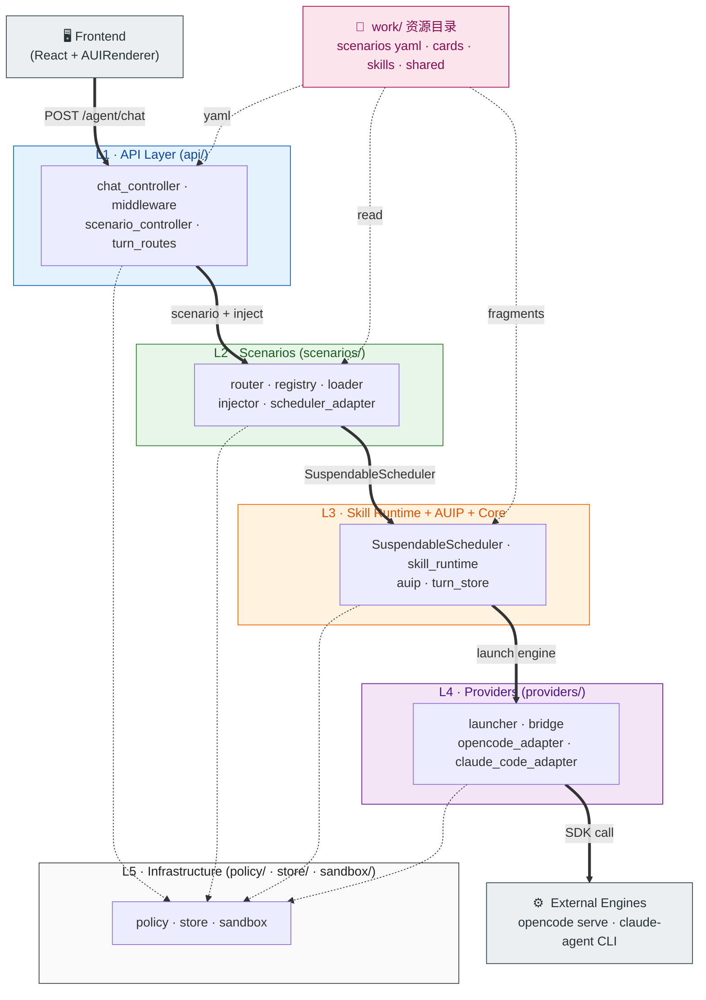
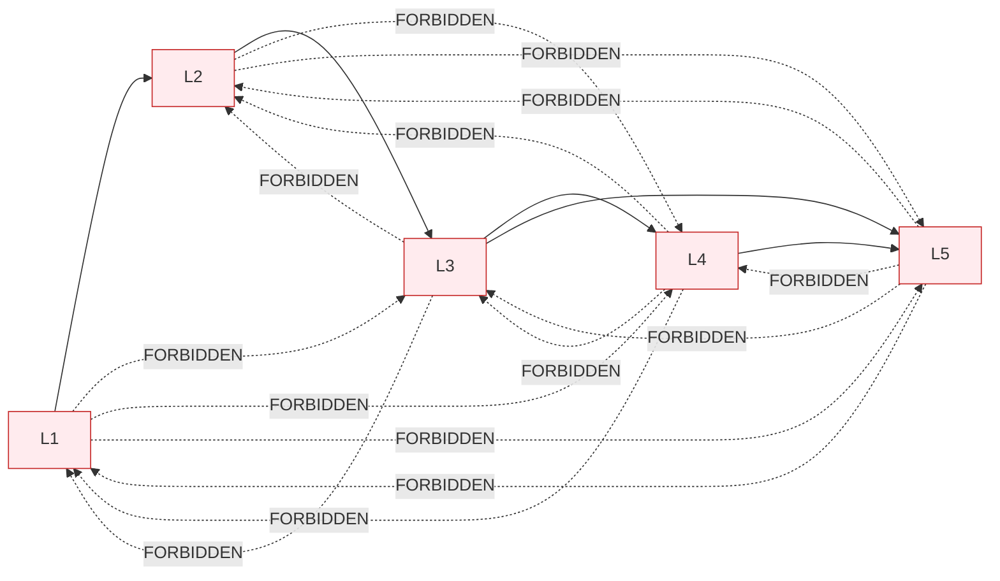
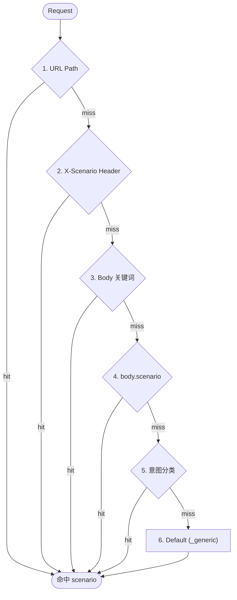
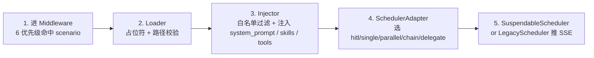
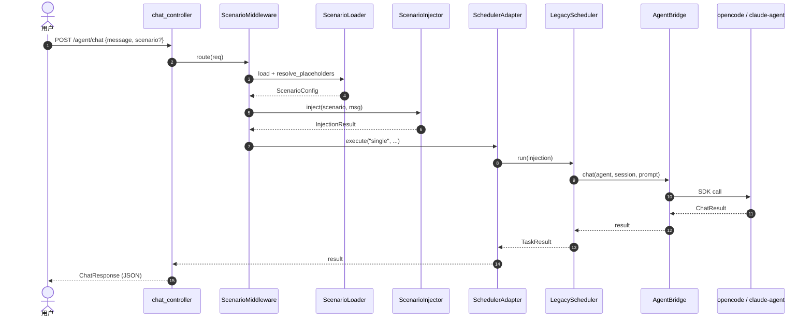
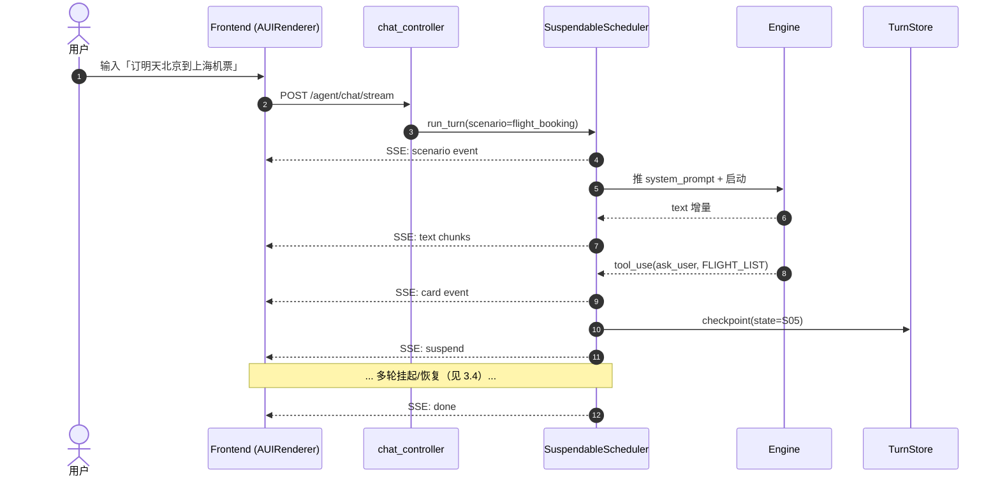
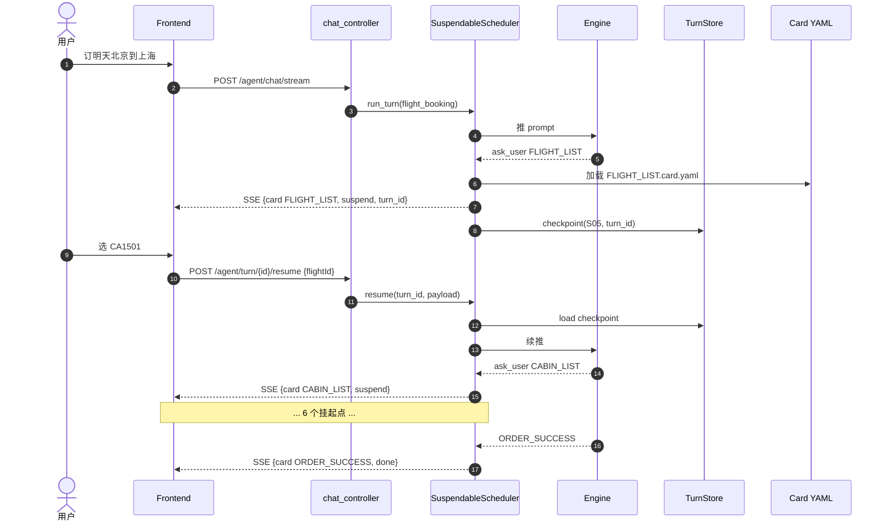
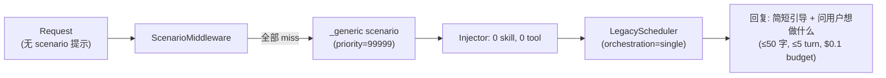

# OpenAgent 架构与对话流程

> **版本**：v0.2 · 2026-06-05
> **读者**：新成员 onboarding / 跨团队 review / 业务方了解"一次 chat 背后发生了什么"
> **配套图**：`docs/design/architecture-mermaid.md`（8 张 mermaid）+ `docs/design/architecture-plantuml.puml`（3 张 PUML）
> **深度文档**：`docs/design/integrated-orchestration-plan.md`（设计源）、`CLAUDE.md`（工程约束）、`docs/api.md`（接口契约）

---

## 0. 一句话总结

> **OpenAgent = 一个 Sanic 网关 + 一个进程内"Scenario 编排层" + 一组外部 LLM 引擎进程（opencode / claude-agent）**。
> **所有 chat 走同一个入口** `POST /agent/chat[/stream]`，由 `ScenarioMiddleware` 决定走哪一套策略，再由 `SuspendableScheduler` 串起 Skill/AUIP/Provider/Policy。

---

## 1. 整体架构（5 层）

### 1.1 一图看全



### 1.2 每层一句话

| 层 | 包 | 一句话职责 | 严禁 |
|---|---|---|---|
| **L1** | `api/` | 收 HTTP、做 scenario 路由、推 SSE | 调 provider / 写 store 原表 |
| **L2** | `scenarios/` | "这次 chat 走哪一套策略"（路由 + 注入 + 编排映射） | 调 provider / 写原表 |
| **L3** | `skill_runtime/` + `auip/` + `core/suspendable*` | "AI 当前在什么状态，该加载什么，该问什么" | 处理 HTTP / 路由决策 |
| **L4** | `providers/` | 协议映射 + 引擎启动（**`cwd = ${PROJECT_DIR}`**） | 业务状态机 / 卡片渲染 |
| **L5** | `policy/` + `store/` + `sandbox/` | 物理资源 + 安全基线 | import 任何上层 |

### 1.3 反向依赖约束（CI 强校验）



校验脚本：`scripts/check_layer_imports.py`（CI 跑）。

---

## 2. 统一对话入口（**绝对约束**）

### 2.1 仅 2 个端点

> 全在 `src/openagent/api/controllers/chat_controller.py`：
>
> - `POST /agent/chat` — 同步 JSON
> - `POST /agent/chat/stream` — SSE 流式

**严禁**新增 per-scenario chat 端点（CI 用 `scripts/check_unified_chat_entry.py` 拦截）：

- ❌ `POST /agent/scenarios/{name}/chat`
- ❌ `POST /agent/scenarios/{name}/chat/stream`
- ❌ 任何 controller / 前端 service 另起的 chat handler

**原因**：Skill 状态机依赖"同一个 turn 内 token 流连续"，多入口破坏这个不变量；routing / 审计 / turn lifecycle 也无法统一。

### 2.2 Scenario 在入口**前**被决定

`ScenarioMiddleware.route()` 在请求到达 chat handler **之前**按 6 优先级命中一个 `ScenarioConfig`：

| # | 来源 | 字段 |
|---|---|---|
| 1 | URL Path | `body.scenario` (作为路径提示) |
| 2 | Header | `X-Scenario: flight_booking` |
| 3 | Body 关键词 | 匹配 `routing.trigger_keywords` |
| 4 | Body 显式 | `body.scenario` |
| 5 | 意图分类 | LlmIntentClassifier |
| 6 | Default | `priority` 最低的 `_generic` |



---

## 3. 对话流程（4 种情形）

### 3.1 总览：一次 chat 走过的 5 步



### 3.2 情形 A：同步对话（`POST /agent/chat`）



### 3.3 情形 B：SSE 流式（`POST /agent/chat/stream`）



**SSE 事件类型**（12 种，定义在 `src/openagent/streaming.py`）：

| 事件 | 含义 |
|---|---|
| `scenario` | 路由命中哪个 scenario |
| `session` | session_id 已建立 |
| `text` | 文本增量 |
| `reasoning` | 模型推理过程 |
| `tool_use` | 模型决定调工具 |
| `tool_result` | 工具返回 |
| `card` | A2UI 卡片推送（前端按 `card_type` 路由组件） |
| `state` | 状态机转移 |
| `suspend` | turn 中断，等待用户输入 |
| `resume` | turn 续跑 |
| `done` | turn 结束 |
| `error` | 错误（带 code + detail） |

### 3.4 情形 C：HITL 交互（SuspendableScheduler）



**关键点**：
- **Checkpoint** 写入 `core/turn_store.py`（Postgres / Memory），支持崩溃恢复
- 每次挂起后，**`/agent/turn/{id}/resume`** 接续，**不需要重新发起 chat**
- Card schema 与前端组件靠 `schema_version` 解耦

### 3.5 情形 D：场景未命中（兜底）



`_generic.scenario.yaml` 是**最低权限兜底**：
- `tool_level: safe`（只读 + 禁 bash + 禁网）
- `a2ui.enabled: false`（不挂卡片）
- `progressive_skill.strategy: none`（不加载任何 skill）
- `max_turns: 5`、`max_budget_usd: 0.1`

---

## 4. Scenario YAML：5 维度配置（5 个新增块）

```yaml
name: flight_booking
version: "1.2.0"
description: "飞鹤差旅机票预订主流程"
owner: team-travel-ai
tier: gold

# === 路由（来自 scenario-routing 原 schema）===
routing:
  trigger_keywords: [订票, 机票, 航班]
  priority: 100

# === 执行（来自 routing 原 schema）===
execution:
  system_prompt: |
    你是飞鹤差旅 AI 助手 ...
  skills: [book-flight, policy-compliance]
  tools: [query_flight_basic, choose_cabin, submit_order]
  orchestration: hitl                # 触发 SuspendableScheduler
  hitl:
    card_schemas: [book-flight-v1]
    suspend_timeout: 300
    state_machine: ${SCENARIO_DIR}/state-machine.yaml

# === 新增 1：安全（来自 agent-sandbox-plan）===
security:
  tool_level: standard
  allowed_tools: [Read, Grep, Glob, Write, Edit, Bash, WebSearch]
  denied_tools: []
  allowed_commands: [ls, cat, grep, git, npm, pnpm, python, pytest]
  denied_commands: [rm -rf, sudo, curl, wget, ssh, scp, dd]
  network: local
  max_turns: 30
  max_budget_usd: 2.0
  require_approval_for_writes: true

# === 新增 2：工作区（user 诉求 3）===
workspace:
  strategy: project_relative
  workspace_dirs:
    - ${PROJECT_DIR}                 # 永远是项目路径
  readonly_dirs:
    - ${SCENARIO_DIR}/prompts
    - ${WORK_SHARED}/docs
  deny_dirs: [/etc, ~/.ssh, ${HOME}]
  deny_path_patterns: ["**/.env", "**/id_rsa", "**/*.pem"]
  launcher:
    prefer_engine: claude_code
    fallback_engine: opencode

# === 新增 3：A2UI（来自 hitl 设计）===
a2ui:
  enabled: true
  protocol: auip
  cards_dir: ${SCENARIO_DIR}/cards
  state_machine: ${SCENARIO_DIR}/state-machine.yaml
  renderer_hint: react_aui_v1
  progressive_loading: true

# === 新增 4：渐进式 SKILL（user 诉求 5）===
progressive_skill:
  strategy: on_demand
  budget_tokens: 4000
  budget_policy: error                # 超 budget 直接抛错，不截断
  initial_skills: [{name: book-flight, mode: summary}]
  load_on_state:
    S05: [book-flight:state-s05, book-flight:cabin-rules]
    S11: [book-flight:state-s11]
    S13: [book-flight:state-s13]

# === 新增 5：资源目录（user 诉求 4）===
resource_dirs:
  prompts: ${SCENARIO_DIR}/prompts
  skills:  ${SCENARIO_DIR}/skills
  shared_skills: ${WORK_SHARED}/skills
  mcp_servers: ${SCENARIO_DIR}/mcp
  cards: ${SCENARIO_DIR}/cards
  state_machine: ${SCENARIO_DIR}/state-machine.yaml

# === 资源分配（routing 原 schema）===
resources:
  agent: claude-core
  model: claude-sonnet-4-5
  timeout: 300

# === 元数据 ===
metadata: {cost_center: T-1001, ab_group: control, sla_tier: gold}
```

**字段来源对照**（**4 份既有方案零修改**）：

| 字段 | 来源 |
|---|---|
| `routing / execution / resources / metadata` | `scenario-routing-proposal.md` 原 schema |
| `security` | `agent-sandbox-plan.md` §3.2 |
| `workspace` | `agent-sandbox-plan.md` §5.1 + §3.3 |
| `a2ui` | `book-flight-hitl-design.md` §4 |
| `progressive_skill` | **新增**（user 诉求 5） |
| `resource_dirs` | **新增**（user 诉求 4） |

---

## 5. 关键设计决策

| # | 决策 | 理由 |
|---|---|---|
| **D1** | **Scenario 是配置不是代码** | 所有策略 YAML 声明，禁 `if scenario == ...` |
| **D2** | **统一 chat 入口** | 状态机依赖 token 流连续，多入口破坏不变量 |
| **D3** | **场景隔离 = 逻辑隔离**（暂） | 不用 Docker；`workspace_dirs` 划清租户 |
| **D4** | **5 层依赖严格向下**（CI 校验） | 防模型自由发挥，便于独立 shippable Phase |
| **D5** | **占位符 + 运行时解析** | `${PROJECT_DIR}` 让同一 YAML 跨租户复用 |
| **D6** | **progressive_skill.budget 强校验** | 超 budget → 报错，**不静默截断** |
| **D7** | **错误带可行动信息**（12 个 code） | 配错时告诉用户"哪个字段、哪条规则、怎么改" |
| **D8** | **引擎 cwd 永远是 `${PROJECT_DIR}`** | 拒 `/`、拒 `$HOME`，由 Launcher 启动前校验 |
| **D9** | **资源统一在 `work/`** | `scenarios/` `shared/` `cache/` `logs/` `archive/` 5 段 |
| **D10** | **8 个独立 Phase，互不卡死** | 任何 Phase 失败回滚不影响其他 |

---

## 6. 6 个场景速览（5×5 矩阵）

| 场景 | security | workspace | a2ui | progressive_skill | orchestration |
|---|---|---|---|---|---|
| `_generic` | **safe** | ro | off | none | single |
| `_default` | safe | ro | off | none | single |
| `flight_booking` | standard | rw | **on, 8 cards** | **on_demand 4k** | **hitl** |
| `expense_audit` | standard | rw | off | all 6k | parallel |
| `customer_service` | safe | 受限 rw | on, 2 cards | on_demand 2k | hitl |
| `code_review` | standard | rw | off | all 6k | delegate |

> 30 个独立配置点，**0 行代码改动**就能支持新场景。

---

## 7. 错误码速查（12 个）

| HTTP | code | 触发条件 | 可行动信息 |
|---|---|---|---|
| 400 | `SCENARIO_NOT_FOUND` | 引用不存在的 scenario | "Available: [...]" |
| 400 | `SCENARIO_DISABLED` | scenario 关闭 | "Enable via PATCH /agent/scenarios/{name} {enabled: true}" |
| 400 | `SCENARIO_VALIDATION_FAILED` | YAML schema 校验失败 | "Field: execution.skills[0]=unknown_skill. Available: [...]" |
| 503 | `SCENARIO_RESOURCE_UNAVAILABLE` | 物理资源缺失 | "Missing: /work/.../cards/OD_INPUT.card.yaml" |
| 503 | `SCENARIO_WORKSPACE_FORBIDDEN` | cwd 是危险路径 | "workspace_dirs[0] = '/' is forbidden" |
| 400 | `SKILL_NOT_ALLOWED` | 越权 skill | "Scenario {} whitelist: [...]. Got: {client}" |
| 400 | `TOOL_NOT_ALLOWED` | 越权 tool | 同上 |
| 400 | `POLICY_VIOLATION` | 路径/命令/网络违规 | "Path '/etc/passwd' not in workspace_dirs" |
| 400 | `SKILL_BUDGET_EXCEEDED` | 渐进式 skill 超预算 | "Loaded 4500 > budget 4000. Reduce load_on_state" |
| 422 | `YAML_PLACEHOLDER_UNRESOLVED` | 占位符没解析到 | "Placeholder ${PROJECT_DIR} not in ctx" |
| 500 | `LAUNCH_FAILED` | 引擎启动失败 | "opencode serve failed at cwd '{cwd}': {stderr}" |
| 500 | `INTERNAL` | 未捕获异常 | 看 stacktrace |

---

## 8. 阅读路径

| 你想了解 | 看哪 |
|---|---|
| **5 层架构长啥样** | `docs/design/architecture-mermaid.md` §1 |
| **6 优先级路由细节** | `docs/design/architecture-mermaid.md` §3 |
| **HITL 时序** | `docs/design/architecture-mermaid.md` §4 |
| **渐进式 SKILL** | `docs/design/architecture-mermaid.md` §6 |
| **work/ 资源布局** | `docs/design/architecture-mermaid.md` §7 |
| **设计源 + 决策** | `docs/design/integrated-orchestration-plan.md` |
| **API 契约** | `docs/api.md` + `docs/api/openapi.json` |
| **测试** | `tests/test_{policy,scenario,launcher,skill_runtime,auip}_*.py` |
| **工程守则** | `CLAUDE.md` + `AGENTS.md` |
| **Skill 开发** | `docs/skills-development-guide.md` |
| **数据库 schema** | `docs/postgres-persistence-plan.md` |
| **旧版对话流程（已废弃）** | `docs/dialogue_flow.md`（保留作历史） |

---

## 附录 A：变更历史

| 版本 | 日期 | 变更 |
|---|---|---|
| v0.1 | 2026-05-29 | 初版（`docs/dialogue_flow.md`，**已废弃**） |
| v0.2 | 2026-06-05 | 重写：合并 Scenario/HITL/AUIP，反映 5 层架构 + 统一 chat 入口 + SuspendableScheduler |
