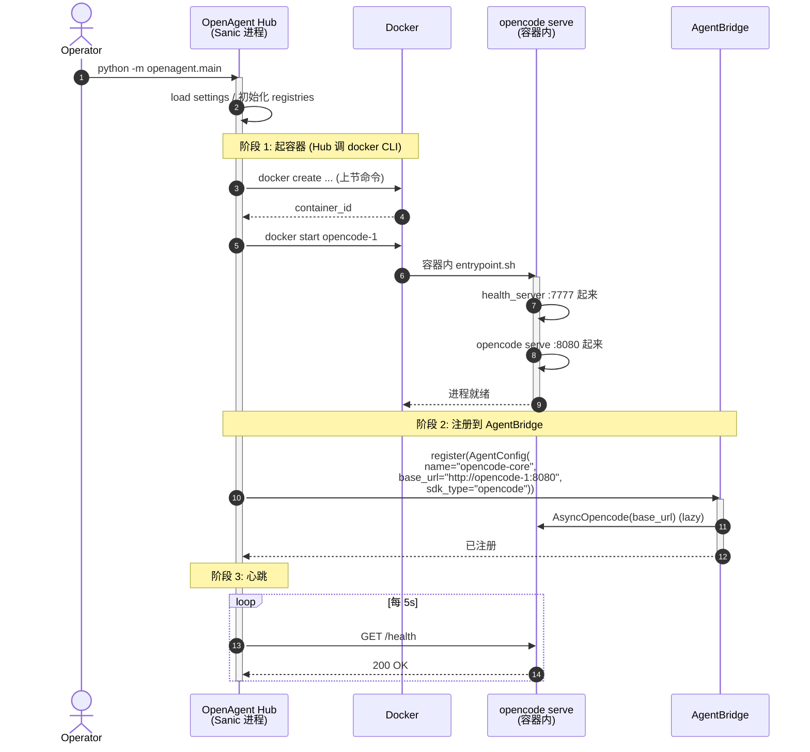
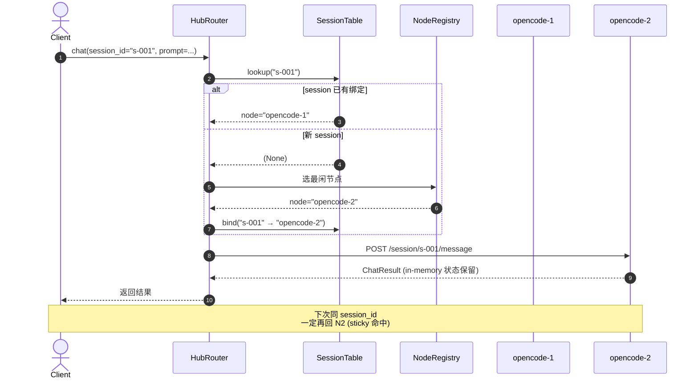
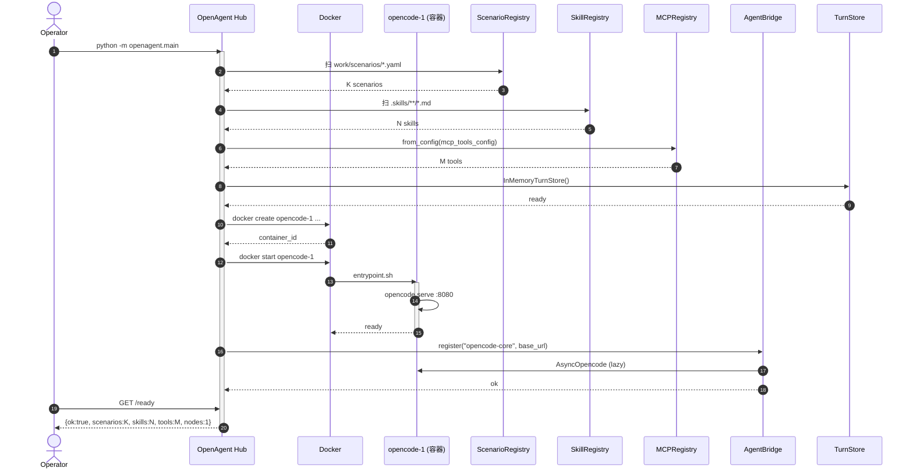
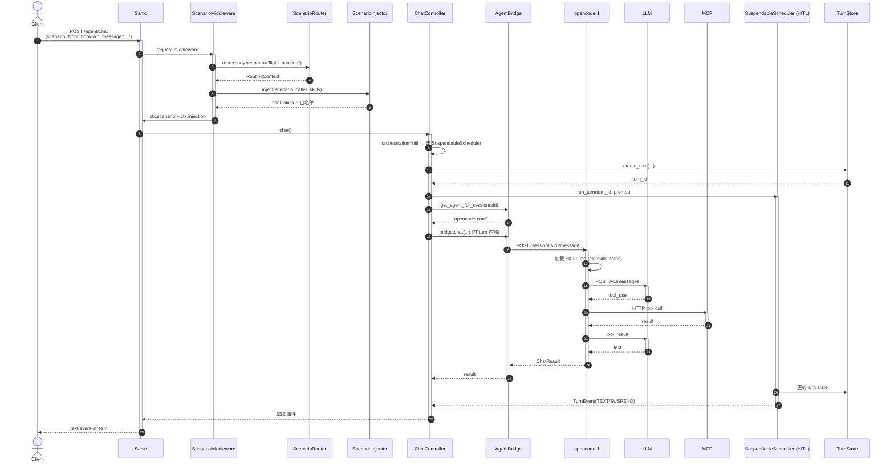
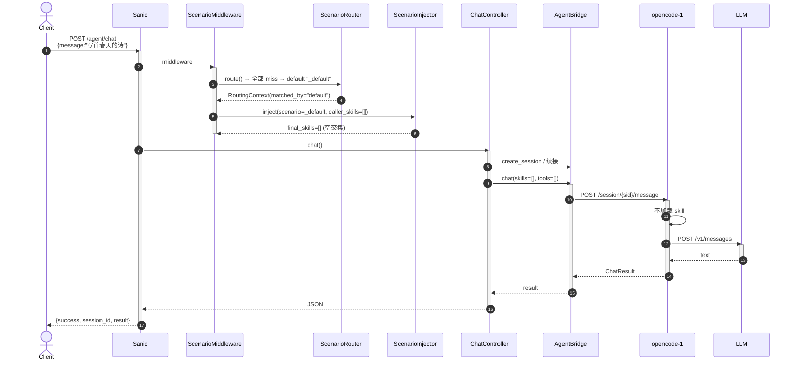
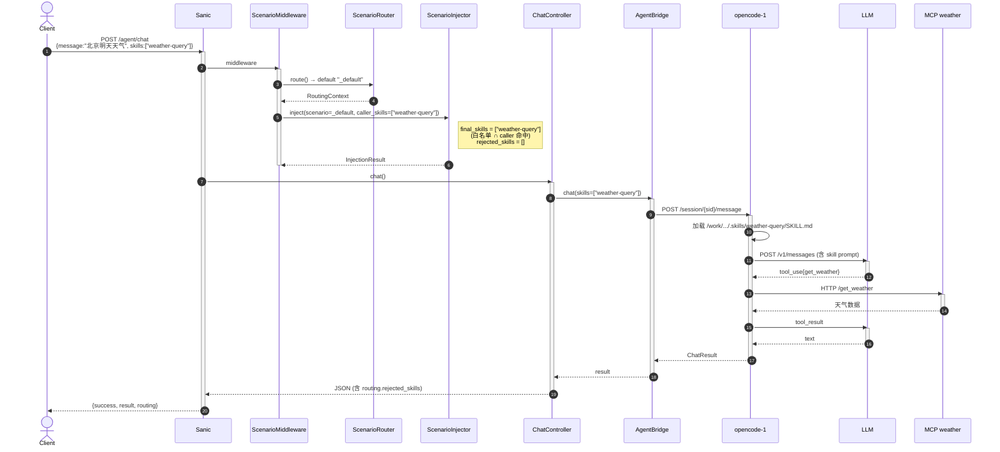

# OpenAgent Agent Sandbox — 概览

> **本文定位**: 设计概览 (高层,4 个问题) — 详细实现见 `agent-sandbox-runtime-design.md`
> **状态**: v0.3 (2026-06-04) — 原生 Docker CLI,持久化优先,env 凭证

---

## TL;DR (30 秒版)

- **沙箱是什么**: 1 个 docker 容器 = 1 个 long-running 的 `opencode serve` 进程 (= 1 个 sandbox 节点)
- **主 OpenAgent 怎么用**: 启动时用 `docker create + start` 把容器跑起来,把它**注册成一个 Agent** 进 `AgentBridge`;之后 `POST /agent/chat` 就是普通的 HTTP 调用
- **多 session**: session 是 opencode 自己的概念 (类似浏览器 tab),**1 个容器里能开 N 个 session 并发**;Hub 用**粘性路由** (`session_id → node_id`) 把同一 session 永远派给同一容器
- **SKILL**: 在容器创建时**只读** bind mount 进 workspace,**不会污染** 容器 (内核 EROFS)
- **凭证**: 走 `docker run -e`,LLM key 直接进容器 env (MVP 接受 risk)
- **生命周期**: `docker stop` 保留环境,`docker rm` 才清;一个容器能跑几天

---

## Q1. 沙箱如何启动 + opencode 服务怎么起 + 怎么跟主 openagent 连

### 1.1 镜像里有什么 (一次构建,到处用)

```dockerfile
# docker/Dockerfile.opencode-sandbox (草案)
FROM node:20-slim
RUN npm install -g opencode-ai@latest        # opencode CLI
COPY entrypoint.sh   /opt/sandbox/
COPY health_server.py /opt/sandbox/
COPY render_config.py /opt/sandbox/          # policy.json → opencode config.json
EXPOSE 7777 8080                              # 7777=healthz, 8080=opencode serve
ENTRYPOINT ["/opt/sandbox/entrypoint.sh"]
```

镜像自带 3 个东西:opencode CLI + 启动脚本 + health server。

### 1.2 启动一个 sandbox 节点 (Hub 端,2 条命令)

```bash
# 1. 创容器 (不起进程,只挂目录)
docker create \
  --name opencode-1 --hostname opencode-1 \
  --read-only --tmpfs /tmp:size=100m \
  --memory 2g --cpus 2 \
  --cap-drop ALL --security-opt no-new-privileges \
  -v /work/tenant-A/project-1:/work/tenant-A/project-1 \                # workspace (rw, host 路径)
  -v /work/shared/skills/flight-query:/work/tenant-A/project-1/.skills/flight-query:ro \  # skill (ro)
  -v /opt/sandbox/policy.json:/opt/sandbox/policy.json:ro \             # 策略 (ro)
  -e ANTHROPIC_API_KEY="$ANTHROPIC_API_KEY" \                            # 凭证
  -e FLIGHT_API_KEY="$FLIGHT_API_KEY" \
  opencode-sandbox:base-v1.4

# 2. 起容器 → 容器内自动跑 entrypoint.sh
docker start opencode-1
```

### 1.3 容器内 entrypoint.sh (opencode 服务怎么起来)

```bash
#!/bin/bash
set -e

# (a) 启 health server (供 Hub 探活,端口 7777)
python3 /opt/sandbox/health_server.py &

# (b) 渲染 opencode 配置
#     读 /opt/sandbox/policy.json → 写 /root/.config/opencode/config.json
#     config.json 里的 "skills": {"paths": [...]} 指向 workspace/.skills/
if [ -f /opt/sandbox/policy.json ]; then
    python3 /opt/sandbox/render_config.py \
        --policy /opt/sandbox/policy.json \
        --output /root/.config/opencode/config.json
fi

# (c) 起 opencode serve (端口 8080,前台进程)
exec opencode serve \
    --port 8080 \
    --hostname 127.0.0.1 \
    --config /root/.config/opencode/config.json
```

**关键事实**:
- `cwd` = workspace 的 host 绝对路径 (`/work/tenant-A/project-1`),不是 `/workspace`
- opencode 通过 env 读 `ANTHROPIC_API_KEY` 等,直连 LLM API
- `config.json` 由 `policy.json` 渲染,**容器层** (不是 tmpfs),`stop` 保留,`rm` 才清

### 1.4 怎么跟主 OpenAgent 连 (3 步,启动期一次)



**就这一件事**: Hub 启动时**像注册本地进程一样注册容器**,之后完全走 HTTP,代码里看不到 "我用的是容器还是本地进程" 的差别。

---

## Q2. opencode SDK 怎么用 + 多 session 路由策略

### 2.1 调用方式 (跟调用本地 opencode **一模一样**)

	`Opencode` 在容器内跑,跟主 OpenAgent 之间的接口就是 `base_url` + HTTP,代码上跟本地 `127.0.0.1:8080` 没差别:

```python
from openagent.providers.opencode_adapter import OpenCodeAdapter
from openagent.providers.base import AgentConfig

adapter = OpenCodeAdapter(
    skill_registry=...,
    mcp_registry=...,
    storage=...,
)
# base_url 指向容器:跟指向本地没差别
# 调用方式: client.session.create() / client.session.chat() / ...
```

**用 opencode-ai SDK** (`client.session.create()`, `client.session.chat()`) 直接调,Hub 不需要任何 "sandbox-aware" 包装。容器对调用方是**透明**的。

### 2.2 session 路由 (重点)

**核心概念**: **容器 ≠ session**。1 个容器能并发 N 个 session。

| 概念 | 谁管 | 数量 | 生命周期 |
|---|---|---|---|
| **OpencodeNode** (容器) | Hub | 2~3 个 | 几小时~几天 |
| **session** (opencode 内) | opencode 自身 | 10~50 / 节点 | 几分钟~几十分钟 |
| **chat turn** (一次请求) | 用户 | 1 / 请求 | < 1 分钟 |

**4 种路由策略** (`ROUTING_STRATEGY` env):

| 策略 | 行为 | 何时用 |
|---|---|---|
| `sticky_session` (默认) | 同 `session_id` 永远 → 同一节点;新 session 选最闲的 | 99% 场景 — 保留 opencode in-memory 上下文 |
| `least_sessions` | 每次按 session 数最少的节点,无粘性 | 纯负载均衡 |
| `round_robin` | 轮询 | 调试 |
| `weighted` | 按权重分配 | 异构硬件 |

**典型流程**:



**为什么默认 sticky**: opencode 内部的 session 状态(对话历史、上下文、变量)是 in-memory;切节点 = 状态丢失。粘性路由让 "10 轮对话" 始终在 1 个容器内,opencode 自己的 in-memory session 能跨轮续接。

---

## Q3. SKILL 怎么用 + 如何保证不污染

### 3.1 加载机制 (ro bind mount + cfg.skills.paths)

```
Host 上 (中心服务):
  /work/shared/skills/flight-query/
  ├── SKILL.md
  ├── scripts/
  └── references/

Hub 端 docker create 时:
  -v /work/shared/skills/flight-query:\
     /work/tenant-A/project-1/.skills/flight-query:ro
                                          ↑
                                   容器内路径 = host 绝对路径
                                   readonly = true (ro bind)
```

**容器内 opencode 看到的**:

```bash
$ ls /work/tenant-A/project-1/.skills/
flight-query/

$ cat /work/tenant-A/project-1/.skills/flight-query/SKILL.md
<skill 内容>

$ echo x > /work/tenant-A/project-1/.skills/flight-query/SKILL.md
bash: ...: Read-only file system   # ★ 内核 EROFS,root 也改不动
```

opencode 启动时 `config.json` 里有:

```json
{
  "skills": {
    "paths": ["/work/tenant-A/project-1/.skills/flight-query"]
  }
}
```

opencode **只从 `cfg.skills.paths` 加载 skill**,不去看 `~/.claude/skills/`。

### 3.2 防污染 3 重保险

| 保险 | 机制 | 防什么 |
|---|---|---|
| **1. ro bind mount** | docker 层 `--mount ...:ro` + 内核 EROFS | opencode 改 skill 文件 (root 也改不动) |
| **2. cfg.skills.paths 显式** | opencode 只读 config 里的 paths,不扫 `~/.claude/skills/` | opencode 自动发现机制塞"野 skill" |
| **3. workspace 隔离** | 每个节点 bind 自己的 workspace | 节点 A 改的文件不会出现在节点 B |

**对比现状 (改造前)**:

| 场景 | 现状 (本机) | 沙箱方案 |
|---|---|---|
| skill 注入方式 | 写到 host `~/.claude/skills/` (软链) | ro bind mount |
| opencode 下次启动 | 看到上次注入的 skill | 看不到 (容器销毁就清) |
| 跑挂影响主进程 | 是 | 否 (容器隔离) |
| 多租户互相可见 | 是 | 否 (各自容器) |
| 中心更新 skill | opencode 进程里还是旧版 | rm + 重建,新 skill |

### 3.3 何时更新 skill (skill 迭代)

skill 文件中心更新后,需要让节点用新版:**rm 当前节点 + 重建** (因为 docker 不允许运行时改 bind mount)。

```python
# Hub 端
await hub.stop_node("opencode-1")
await hub.rm_node("opencode-1")
new_node = await hub.create_node(  # 自动挂新版本的 skill
    image="opencode-sandbox:base-v1.4",
    workspace=workspace,
    skills=["flight-query"],  # 用 SkillRegistry 拿到新 digest
)
```

---

## Q4. 整体对话时序流程

### 4.1 服务启动 (3 阶段)



### 4.2 场景对话 (body.scenario = "flight_booking",HITL 编排)



### 4.3 普通对话 (无 scenario,命中 _default)



### 4.4 单独加载 skill 对话 (无 scenario,body.skills=["weather-query"],_default 允许)



---

## 一图总结 (3 种对话的核心差异)

| 维度 | 场景对话 | 普通对话 | 单独加载 skill |
|---|---|---|---|
| `body.scenario` | ✅ 显式 | ❌ | ❌ |
| `body.skills` | 可选 | ❌ | ✅ 显式 |
| ScnRouter 命中 | URL/Header/Body/Keyword | `default` | `default` |
| `matched_by` | `body` 等 | `default` | `default` |
| `final_skills` | scenario ∩ caller | `[]` | caller (若允许) |
| 加载 skill | ✅ | ❌ | ✅ |
| 可走 HITL | ✅ | ❌ | ❌ |

---

## 关键文件速查

| 文件 | 作用 |
|---|---|
| `src/openagent/providers/launcher.py` | **(改造目标)** 从 `Popen` 切到 `HubRouter` |
| `src/openagent/providers/opencode_adapter.py` | opencode 适配器 (对调用方透明) |
| `src/openagent/providers/agent_bridge.py` | AgentBridge — 注册/路由 |
| `docker/Dockerfile.opencode-sandbox` | 基础镜像 |
| `docker/entrypoint.sh` | 容器内启动脚本 |
| `docker/render_config.py` | policy.json → opencode config.json |
| `docker/health_server.py` | 容器内 /healthz |
| `work/scenarios/*.scenario.yaml` | scenario 定义 |
| `src/openagent/.skills/**/*.md` | skill 源 (中心服务持有) |
| `work/<tenant>/<project>/` | workspace 目录 (host 上) |

---

## Q5. Docker 启动 + PyCharm 配置 (从 0 跑起来)

### 5.1 文件结构

```
openagent/
├── docker/
│   ├── Dockerfile.openagent.deps       # 1. 装 Python 依赖 (慢,缓存)
│   ├── Dockerfile.openagent.runtime    # 2. 复制源码 + 启动 (快)
│   ├── Dockerfile.opencode-sandbox     # 3. opencode 镜像 (Node 24)
│   ├── entrypoint.sh
│   ├── health_server.py
│   └── render_config.py
├── docker-compose.yml                  # 主 compose
├── docker-compose.override.yml         # 开发模式 (热重载,可选)
├── pyproject.toml
├── .env                                 # API key 等
├── work/
└── src/openagent/
```

### 5.2 双 Dockerfile 策略 (deps + runtime)

**思路**: 拆"装依赖"和"放代码"成 2 个镜像层。**改代码不重装依赖**,改依赖才重装 (省时间)。

**`docker/Dockerfile.openagent.deps`** — 依赖层 (首次 5-10 分钟,之后秒级命中缓存):

```dockerfile
FROM python:3.11-slim

WORKDIR /app

# 系统工具
RUN apt-get update && apt-get install -y --no-install-recommends \
    build-essential git curl \
    && rm -rf /var/lib/apt/lists/*

# Python 依赖 (这一层缓存复用率最高)
COPY pyproject.toml ./
# 如果用 poetry:
#   COPY poetry.lock pyproject.toml ./
#   RUN pip install --no-cache-dir poetry \
#    && poetry config virtualenvs.create false \
#    && poetry install --no-interaction --no-ansi
# 或 pip:
RUN pip install --no-cache-dir -U pip \
 && pip install --no-cache-dir .
```

**`docker/Dockerfile.openagent.runtime`** — 源码层 (改代码几秒):

```dockerfile
FROM openagent-deps:latest

WORKDIR /app

# 复制源码
COPY . /app

# Sanic 自带 reload 模式 (dev 用),compose 可覆盖
ENV PYTHONUNBUFFERED=1
CMD ["python", "-m", "openagent.main"]
```

**构建命令**:

```bash
# 1. 装依赖 (慢,1 次)
docker build -f docker/Dockerfile.openagent.deps -t openagent-deps:latest .

# 2. 打包 runtime (快,改代码都重跑)
docker build -f docker/Dockerfile.openagent.runtime -t openagent:dev .

# 或一条搞定:docker compose build (会按依赖顺序自动跑)
```

### 5.3 opencode-sandbox 镜像 (Node 24)

```dockerfile
# docker/Dockerfile.opencode-sandbox
FROM node:24-slim                       # ★ v0.4: 升级到 Node 24+

# opencode CLI
RUN npm install -g opencode-ai@latest

# sandbox 内部件
RUN mkdir -p /opt/sandbox
COPY entrypoint.sh    /opt/sandbox/entrypoint.sh
COPY health_server.py /opt/sandbox/health_server.py
COPY render_config.py /opt/sandbox/render_config.py
RUN chmod +x /opt/sandbox/entrypoint.sh

EXPOSE 7777 8080
ENTRYPOINT ["/opt/sandbox/entrypoint.sh"]
HEALTHCHECK --interval=5s --timeout=2s \
  CMD curl -f http://127.0.0.1:7777/healthz || exit 1
```

### 5.4 docker-compose.yml (1 hub + 1 sandbox)

```yaml
# docker-compose.yml
version: '3.8'

services:
  # ============ OpenAgent Hub (主服务) ============
  openagent-hub:
    build:
      context: .
      dockerfile: docker/Dockerfile.openagent.runtime
    image: openagent:dev
    container_name: openagent-hub
    ports:
      - "8000:8000"                       # Hub 对外 API
    environment:
      # LLM 凭证 (model 字符串决定用哪个 provider,见 §5.8)
      - ANTHROPIC_API_KEY=${ANTHROPIC_API_KEY:-}    # 用 anthropic/* 时填
      - OPENAI_API_KEY=${OPENAI_API_KEY:-}          # 用 openai/* 时填
      - OPENAI_BASE_URL=${OPENAI_BASE_URL:-}        # 自建 / OpenAI 兼容端点
      # skill 业务 API
      - FLIGHT_API_KEY=${FLIGHT_API_KEY:-}
      # OpenAgent 内部
      - OPENCODE_NODES=http://opencode-1:8080
      - ROUTING_STRATEGY=sticky_session
      - PYTHONUNBUFFERED=1
    depends_on:
      opencode-1:
        condition: service_healthy
    networks: [sandbox-net]
    # 开发模式 (docker-compose.override.yml) 会加:
    # volumes: [".:/app"]   # 源码热重载

  # ============ opencode 节点 (1 个,后面要加就复制) ============
  opencode-1:
    build:
      context: .
      dockerfile: docker/Dockerfile.opencode-sandbox
    image: opencode-sandbox:dev
    container_name: opencode-1
    hostname: opencode-1
    read_only: true
    cap_drop: [ALL]
    security_opt: [no-new-privileges]
    tmpfs:
      - /tmp:size=100m
    mem_limit: 2g
    cpus: 2
    environment:
      # LLM 凭证 (跟 hub 同源,opencode serve 容器内读)
      - ANTHROPIC_API_KEY=${ANTHROPIC_API_KEY:-}
      - OPENAI_API_KEY=${OPENAI_API_KEY:-}
      - OPENAI_BASE_URL=${OPENAI_BASE_URL:-}
      # skill 业务 API
      - FLIGHT_API_KEY=${FLIGHT_API_KEY:-}
    volumes:
      # workspace (rw, host 路径)
      - ${WORKSPACE_HOST_PATH}:${WORKSPACE_HOST_PATH}
      # skill 源 (ro)
      - ${SKILLS_SHARED_DIR}:/work/shared/skills:ro
    healthcheck:
      test: ["CMD", "curl", "-f", "http://localhost:7777/healthz"]
      interval: 5s
      timeout: 2s
      retries: 3
    networks: [sandbox-net]

networks:
  sandbox-net:
    driver: bridge
```

`.env` 文件:

```bash
# === LLM 凭证 (二选一,或并存;model 字符串决定用哪个) ===
# 方案 A: Anthropic Claude
# ANTHROPIC_API_KEY=sk-ant-xxx

# 方案 B: OpenAI 兼容 (DeepSeek/Qwen/GLM/Ollama/自建等,推荐)
OPENAI_API_KEY=sk-xxx
OPENAI_BASE_URL=https://api.deepseek.com/v1   # 改成你的实际 URL

# === Skill 业务 API ===
FLIGHT_API_KEY=flight-xxx

# === Workspace 挂载 ===
WORKSPACE_HOST_PATH=/work/tenant-A/project-1
SKILLS_SHARED_DIR=./work/shared/skills
```

> **不知道填什么?** 跳到 §5.8 看常用 LLM provider 速查表 (DeepSeek/Qwen/GLM/Ollama/自建)。

### 5.5 启动 / 重启 / 停止

```bash
# 1. 首次: build + 跑
docker compose build
docker compose up -d

# 2. 看状态
docker compose ps                 # 2 容器都 Up / healthy
docker compose logs -f openagent-hub
docker compose logs -f opencode-1

# 3. 验证
curl http://localhost:8000/ready  # {"ok": true, ...}

# 4. 跑第一个 chat
curl -X POST http://localhost:8000/agent/chat \
  -H "Content-Type: application/json" \
  -d '{"scenario":"flight_booking","message":"查明天到深圳的航班"}'

# 5. 改代码后: 只重启 hub (opencode 不动)
docker compose restart openagent-hub

# 6. 全停
docker compose down               # 不删 volume
docker compose down -v            # 也删 volume (慎)
```

### 5.6 PyCharm 配置 (Windows 用 Docker 跑程序)

**目标**: 在 PyCharm 里编辑代码 + 调试,跑的是 Docker 里的 Python,不是 Windows 本地。

**前置**:
- Docker Desktop on Windows,WSL2 后端 (推荐)
- PyCharm **Professional** (Community 没有 Docker 解释器)
- 已经 `docker compose build` 过,`openagent:dev` 镜像存在

#### 步骤 1: 先把 opencode-1 跑起来

```bash
docker compose up -d opencode-1
docker compose ps   # opencode-1 应为 healthy
```

#### 步骤 2: PyCharm 加 Docker 解释器

`File → Settings → Project: OpenAgent → Python Interpreter`
→ 齿轮 `⚙` → `Add Interpreter → On Docker...`

| 字段 | 值 |
|---|---|
| Server | Docker (默认) |
| Image name | `openagent:dev` |
| Python interpreter path | `/usr/local/bin/python` |
| **Configuration file** (点开 Advanced) | |
| → Network mode | `sandbox_default` (compose 创建的网络) |
| → Environment variables | `OPENAI_API_KEY=xxx` / `OPENAI_BASE_URL=https://...` / `FLIGHT_API_KEY=xxx` / `OPENCODE_NODES=http://opencode-1:8080` (详见 §5.8) |
| → Volume mounts | Host: `C:\WorkSpace\Coding\OpenAgent` → Container: `/app` |

点 OK,等 1-2 分钟 PyCharm 把解释器拉起来。

#### 步骤 3: Run/Debug 配置

`Run → Edit Configurations → + → Python`

| 字段 | 值 |
|---|---|
| Name | `OpenAgent Hub` |
| Module name | `openagent.main` (不是 script path) |
| Working directory | `/app` |
| Python interpreter | 选步骤 2 那个 Docker 解释器 |
| Path mappings | Local `C:\WorkSpace\Coding\OpenAgent` ↔ Remote `/app` |
| Environment variables | (同步骤 2) |

Apply → OK。

#### 步骤 4: 跑

- 工具栏绿色 ▶️ (Shift+F10)
- PyCharm 在容器里 `python -m pydevd ...`,起 hub,debugger 自动 attach
- Run 窗口看日志,断点处会停

**改代码**: PyCharm 改 → 容器内 `/app` 立刻同步 (volume mount) → 工具栏 `■` 停 → 再 ▶️ 重启 (10 秒内)

**调试**: 左边 gutter 点设断点 → F8 (Step Over) / F7 (Step Into) / F9 (Resume)

**看容器日志**: 另一个终端跑 `docker logs -f openagent-hub` 或 `docker compose logs -f openagent-hub`

#### Windows 性能优化 (重要!)

WSL2 + Docker Desktop 时,代码在 **Windows 文件系统** (如 `C:\...`) 走 9P 跨边界传给容器,**很慢**(改一行代码 1-2 秒同步)。

**推荐方案**: 代码放 WSL2 文件系统,PyCharm 通过 WSL 远程打开。

```powershell
# PowerShell
wsl --install -d Ubuntu                  # 装 WSL2 (一次)
# 在 WSL 里:
wsl
cd ~
git clone <openagent-repo> openagent
cd openagent
cp .env.example .env
# 编辑 .env 填 API key
docker compose build
docker compose up -d
exit
```

```text
PyCharm:
File → Open → \\wsl$\Ubuntu\home\<user>\openagent
(第一次 PyCharm 会在 WSL 里装 server,等 2-3 分钟)
```

之后改代码、保存、调试,全是 WSL2 文件系统内操作,速度提升 ~10x。

### 5.7 常见坑

| 坑 | 原因 | 解决 |
|---|---|---|
| 容器起来了但 Hub 找不到 opencode | Hub 跟 opencode-1 不在同网络 | PyCharm 解释器 Network mode 填 `sandbox_default` |
| 改代码后行为没变 | 代码没进容器 | 确认 volume mount 配对;或 `docker compose restart openagent-hub` |
| `docker compose build` 很慢 | deps 缓存失效 | 检查 `pyproject.toml` 是不是频繁改;`Dockerfile.openagent.deps` 只 COPY 这一个文件 |
| Windows 文件系统跑 Docker 卡 | 9P 协议慢 | 代码移到 WSL2 文件系统 (§5.6 末尾) |
| PyCharm 找不到 `openagent.main` 模块 | Working dir 不对 | 填 `/app` 而不是 `/` |
| 容器内 LLM key (OPENAI_API_KEY) 是空 | env 没传进去 | PyCharm 解释器 + Run Config 两处都要加 env vars (参照 §5.8 配 OpenAI 兼容端点) |
| opencode 容器 healthcheck 一直 unhealthy | entrypoint 没启 health server | `docker logs opencode-1` 看启动日志;`docker exec opencode-1 curl localhost:7777/healthz` 手动测 |

### 5.8 LLM 模型与 URL 配置 (自建 / DeepSeek / Qwen / GLM / Ollama 等)

> opencode 不用 Anthropic 也行 — 用 `openai/<model>` 走 **OpenAI 兼容端点**,适用于绝大多数国内/自建 LLM。

#### 原理 (3 件套对齐)

| 要素 | 填在哪 | 例子 |
|---|---|---|
| **API key** | `.env` → `OPENAI_API_KEY` | `sk-xxx` |
| **API URL** | `.env` → `OPENAI_BASE_URL` | `https://api.deepseek.com/v1` |
| **Model id** | scenario YAML → `agent.model` | `openai/deepseek-chat` |

**3 处一致才能跑通**: key 有效 + URL 可达 + model id 在该端点存在。

#### 步骤 1: 改 `.env`

```bash
# === OpenAI 兼容 (推荐) ===
OPENAI_API_KEY=sk-xxx
OPENAI_BASE_URL=https://api.deepseek.com/v1   # 改成你的实际 URL

# === 本地 Ollama ===
# OPENAI_API_KEY=ollama                          # 任意非空 (ollama 不校验)
# OPENAI_BASE_URL=http://host.docker.internal:11434/v1
#   ↑ host.docker.internal 是 docker 内访问 host 的特殊域名

# === Anthropic Claude (备选) ===
# ANTHROPIC_API_KEY=sk-ant-xxx
```

#### 步骤 2: 改 scenario YAML 的 `agent.model`

opencode 的 model 格式是 **`<provider>/<model-id>`**,provider 决定用哪套凭证:

```yaml
# work/scenarios/_default.scenario.yaml
name: _default
version: "1.0.0"
enabled: true
routing:
  default_priority: 100
  trigger_keywords: []
execution:
  orchestration: single
  system_prompt: |
    你是一个 helpful 的助手。
  skills: []
  tools: []
  agent:
    name: opencode
    model: openai/deepseek-chat      # ★ 这里
  workspace: ~
  max_turns: 30
  max_budget_usd: 2.0
```

#### 常用 model 速查表

| Provider | model 字符串 | `OPENAI_BASE_URL` | 备注 |
|---|---|---|---|
| **DeepSeek** | `openai/deepseek-chat` | `https://api.deepseek.com/v1` | V3, 通用对话 |
| **DeepSeek** | `openai/deepseek-reasoner` | `https://api.deepseek.com/v1` | R1, 推理强 |
| **Qwen (阿里百炼)** | `openai/qwen-max` | `https://dashscope.aliyuncs.com/compatible-mode/v1` | 顶级 |
| **Qwen** | `openai/qwen-plus` | 同上 | 性价比 |
| **Qwen** | `openai/qwen-turbo` | 同上 | 便宜快 |
| **GLM (智谱)** | `openai/glm-4-plus` | `https://open.bigmodel.cn/api/paas/v4/` | 顶级 |
| **GLM** | `openai/glm-4-flash` | 同上 | 免费额度 |
| **Moonshot (Kimi)** | `openai/moonshot-v1-8k` | `https://api.moonshot.cn/v1` | 长上下文 |
| **Moonshot** | `openai/moonshot-v1-128k` | 同上 | 128k |
| **Hunyuan (腾讯混元)** | `openai/hunyuan-pro` | `https://api.hunyuan.tencent.com/v1` | 需申请 |
| **Doubao (豆包)** | `openai/doubao-pro-32k` | `https://ark.cn-beijing.volces.com/api/v3` | 火山 |
| **Ollama (本地)** | `openai/llama3.1` | `http://host.docker.internal:11434/v1` | 需 `ollama serve` |
| **Ollama** | `openai/qwen2.5-coder:7b` | 同上 | 代码模型 |
| **自建 vLLM** | `openai/<你的 model id>` | `http://<host>:<port>/v1` | OpenAI 兼容 |
| **Anthropic Claude** | `anthropic/claude-sonnet-4-5` | (不需要,走 `ANTHROPIC_API_KEY`) | 备选 |

> **怎么知道 model id?** 看该 provider 的官方文档,或 curl 一下 `/v1/models` 端点看它暴露了哪些:
> ```bash
> curl https://api.deepseek.com/v1/models -H "Authorization: Bearer $OPENAI_API_KEY"
> ```

#### 步骤 3: 重启 + 验证

```bash
# 改完 .env / scenario 后,重启 opencode-1 让 env 生效
docker compose restart opencode-1
docker compose logs -f opencode-1
# 期望看到: opencode serve 启动,无 env 缺失报错

# 跑一个 chat
curl -X POST http://localhost:8000/agent/chat \
  -H "Content-Type: application/json" \
  -d '{"message":"用一句话介绍你自己"}'

# 看 opencode-1 日志,期望看到:
#   POST https://api.deepseek.com/v1/chat/completions
#  ↑ 你的 BASE_URL,不是 anthropic.com
docker compose logs --tail=20 opencode-1 | grep -E "POST|model"
```

#### 多 provider 混用 (不同 scenario 用不同模型)

每个 scenario 独立配 `agent.model`,互不影响:

```yaml
# work/scenarios/code_review.scenario.yaml
agent:
  model: openai/qwen2.5-coder:32b     # 代码用 Qwen coder

# work/scenarios/flight_booking.scenario.yaml
agent:
  model: openai/deepseek-chat         # 通用对话用 DeepSeek

# work/scenarios/long_doc.scenario.yaml
agent:
  model: openai/moonshot-v1-128k      # 长文档用 Moonshot
```

`.env` 里 `OPENAI_API_KEY` + `OPENAI_BASE_URL` 可以是**任一** provider 的(因为都是 OpenAI 兼容),其他 provider 需另加 key(目前 opencode 的 `openai` provider 不支持多 endpoint 切换,真要混用多个非 OpenAI 兼容端点要进 §5.8 末尾的"高级"方案)。

#### 高级: 自定义 provider (非 OpenAI 兼容)

如果你的端点不是 OpenAI 兼容 (Azure OpenAI 旧版 / AWS Bedrock / 私有协议),需要改 `docker/render_config.py`,在生成的 `config.json` 里加自定义 provider:

```python
# docker/render_config.py (示意)
def render_config(policy: dict) -> dict:
    cfg = {
        "model": policy["agent"]["model"],
        "provider": {
            # OpenAI 兼容 (走 env: OPENAI_API_KEY + OPENAI_BASE_URL)
            "openai": {
                "options": {
                    "baseURL": "${OPENAI_BASE_URL}",  # opencode 支持 ${ENV} 替换
                }
            },
            # 自定义 provider 示例
            "mycorp": {
                "npm": "@ai-sdk/openai-compatible",
                "options": {
                    "baseURL": "https://llm.mycorp.internal/v1",
                },
                "models": {
                    "my-model": {"name": "My Model"}
                }
            }
        }
    }
    return cfg
```

参考: <https://opencode.ai/docs/providers/>

#### 常见坑

| 坑 | 原因 | 解决 |
|---|---|---|
| `opencode serve` 启动报 `model not found` | model 字符串拼错 | 改成 `openai/<实际 model id>`,别带空格 |
| `OPENAI_BASE_URL` 不生效 | opencode 用的是 `openai` provider,但 baseURL 没透传 | 确保 `.env` 有 `OPENAI_BASE_URL=...` + 重启容器 |
| 连接超时 | URL 拼错,或网络不通 | `docker exec opencode-1 curl -v $OPENAI_BASE_URL/models -H "Authorization: Bearer $OPENAI_API_KEY"` |
| 401 Unauthorized | key 错 | 重置 `.env` 的 `OPENAI_API_KEY` |
| 404 model not found | 该 provider 没这个 model id | curl `/v1/models` 看实际暴露的 id |
| 本地 Ollama 连不上 (从容器内) | `localhost:11434` 指的是容器内 localhost | 改 `host.docker.internal:11434` |

---

## 跟旧版对比 (一句话)

| 旧 (`Popen`) | 新 (docker sandbox) |
|---|---|
| 1 个本机进程跑所有 session | 2~3 个容器,每个容器跑 N 个 session |
| skill 写 host 软链,污染全局 | ro bind mount,容器销毁就清 |
| 跑挂拖垮主进程 | 容器隔离,跑挂只挂自己 |
| 单机 | 集群 (加节点 = 改 compose) |

---

## 详细文档

看 `docs/design/agent-sandbox-runtime-design.md` (旧版,含完整数据结构、决策表、Phase 1-5 实施路线、测试用例、失败模式)。
