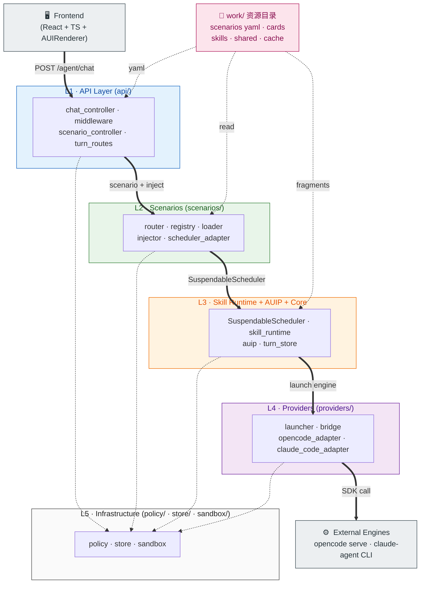
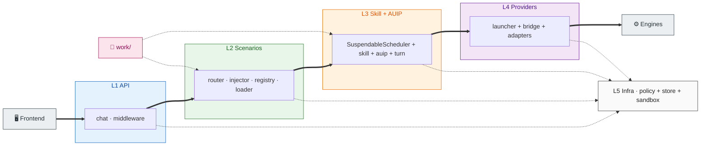
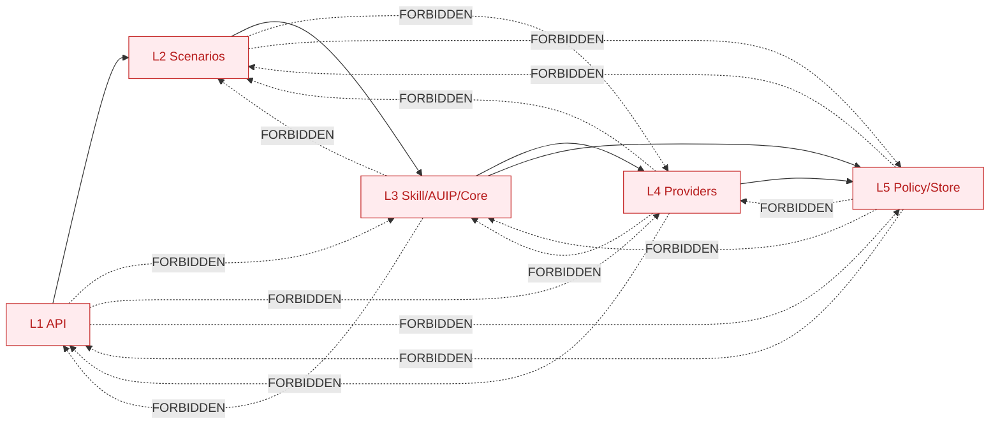
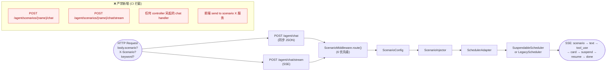
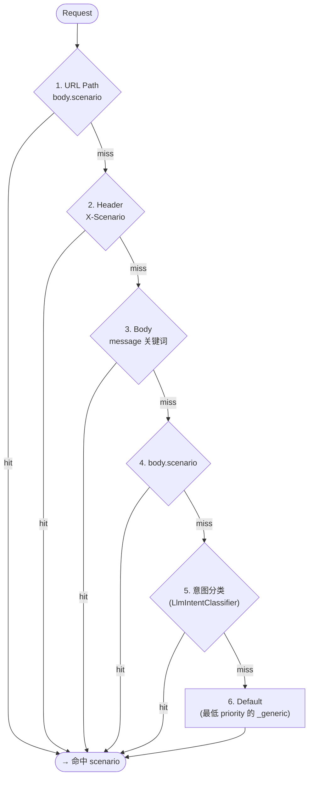
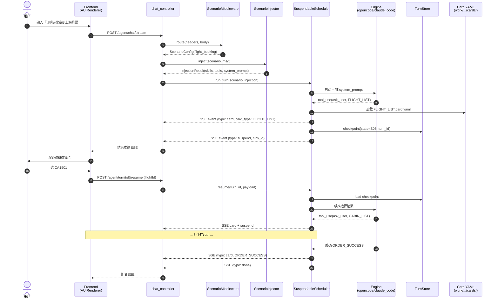
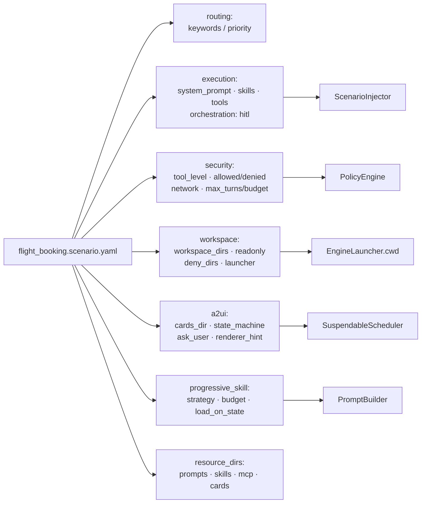
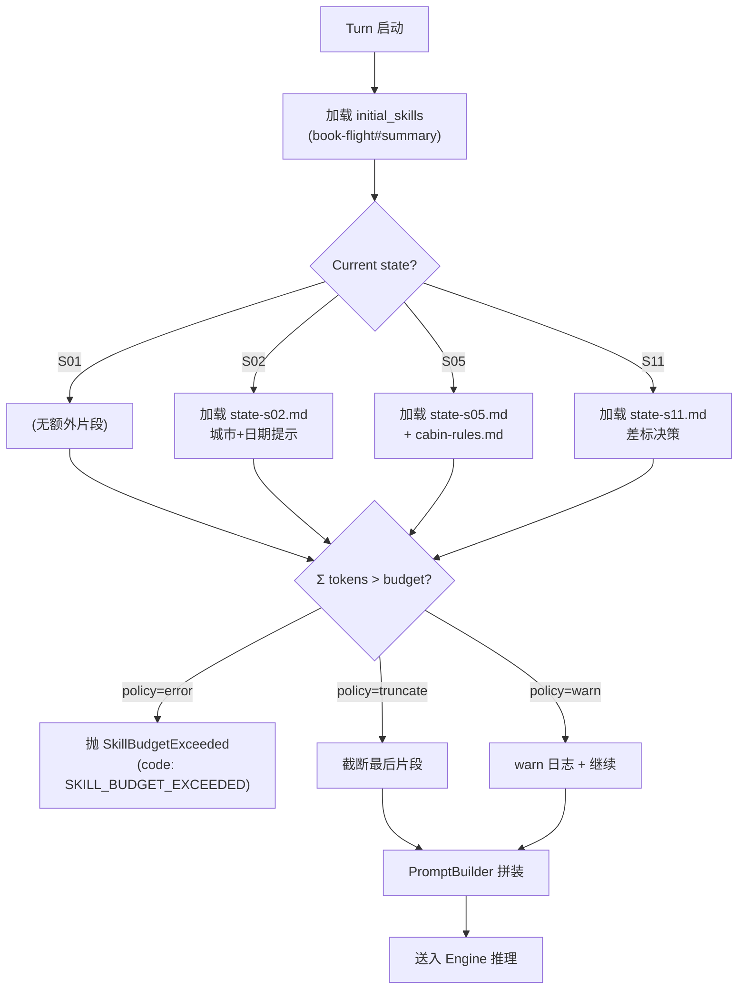
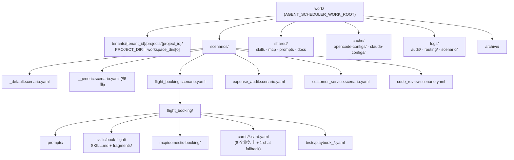
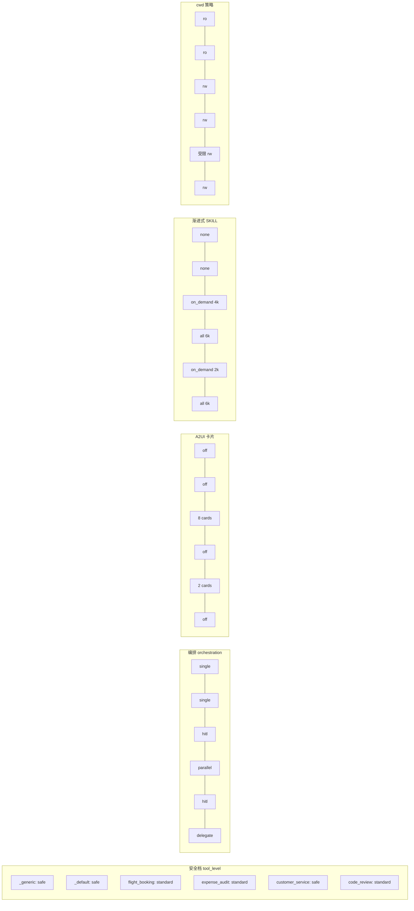

# OpenAgent 架构 Mermaid 图（v0.1 — 2026-06-05）

> 基于 `docs/design/integrated-orchestration-plan.md` + `CLAUDE.md` 当前实现的"最新架构"。
> 5 层代码分层、**统一对话入口**（仅 `POST /agent/chat` 与 `/agent/chat/stream`）、Scenario × Skill Runtime × AUIP 整合。

---

## 1. 总体架构（5 层泳道 + 资源 + 基础设施）

> **设计原则**：每层一个色块泳道，主流程 `==>` 粗箭头沿 L1→L4 一路下穿；
> `work/` 资源在左、`L5` 基础设施在底作 foundation，全用虚线 `-->` 表示非主链路。
> 组件级细节见 §2–§8。

### 1.0.1 横向版（LR，适合宽屏）

### 1.1 反向依赖约束（CI 强校验）

---

## 2. 统一对话入口（绝对约束）

> **仅 2 个端点** 都在 `api/controllers/chat_controller.py`，Scenario 路由发生在入口**前**。

---

## 3. 6 优先级路由（ScenarioRouter）

---

## 4. HITL / A2UI 流转（SuspendableScheduler）

---

## 5. Scenario YAML → 5 维度配置

---

## 6. 渐进式 SKILL 加载（按 state）

---

## 7. work/ 资源目录布局

---

## 8. 5 场景 × 5 维度速览

---

## 阅读指南

| 图 | 看什么 | 出问题找谁 |
|---|---|---|
| §1 总体 | 5 层边界 + 反向 import 约束 | 跨层调用先查这里 |
| §2 统一入口 | 唯一 2 个 chat 端点 | 想加 scenario URL → 删 |
| §3 6 优先级 | 路由命中顺序 | 关键词没命中 → 看这里 |
| §4 HITL 时序 | Card + suspend + resume 全链路 | 状态机卡住 → 走读时序 |
| §5 YAML 字段 | 5 个新增块来源 | 配置缺字段 → 对照 §5.1 |
| §6 渐进式 | budget 强制点 | 加载报错 → 看 policy |
| §7 资源布局 | work/ 子目录 | 文件该放哪 → 看这里 |
| §8 5×5 对比 | 5 场景速查 | "X 场景能不能做 Y" → 看这里 |
