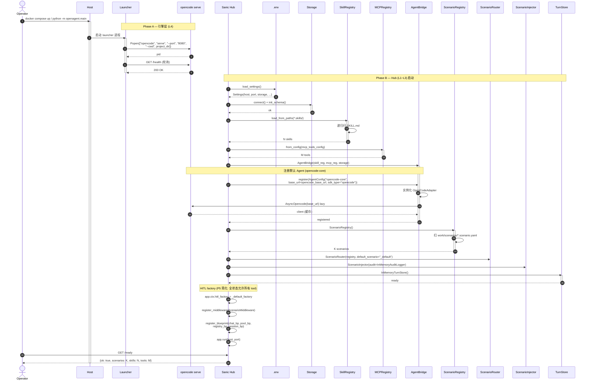
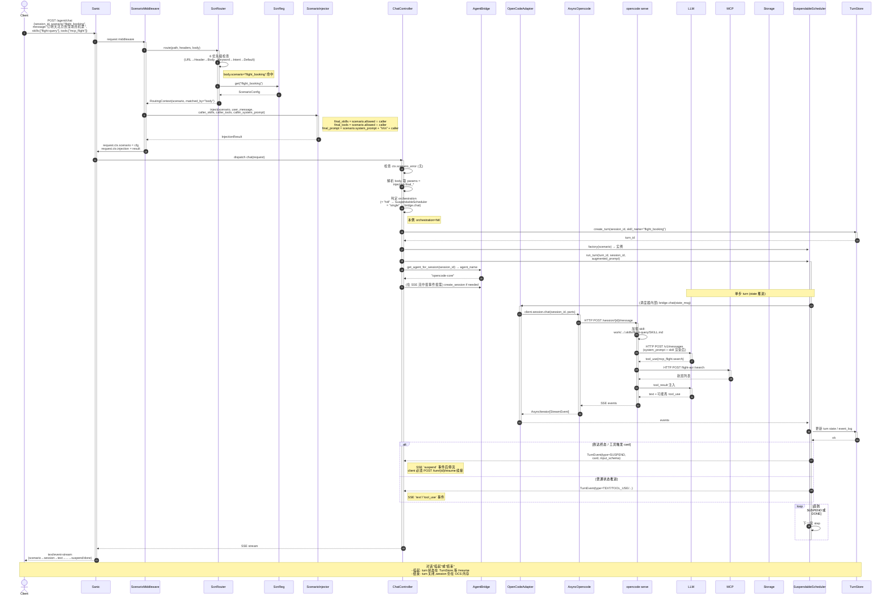
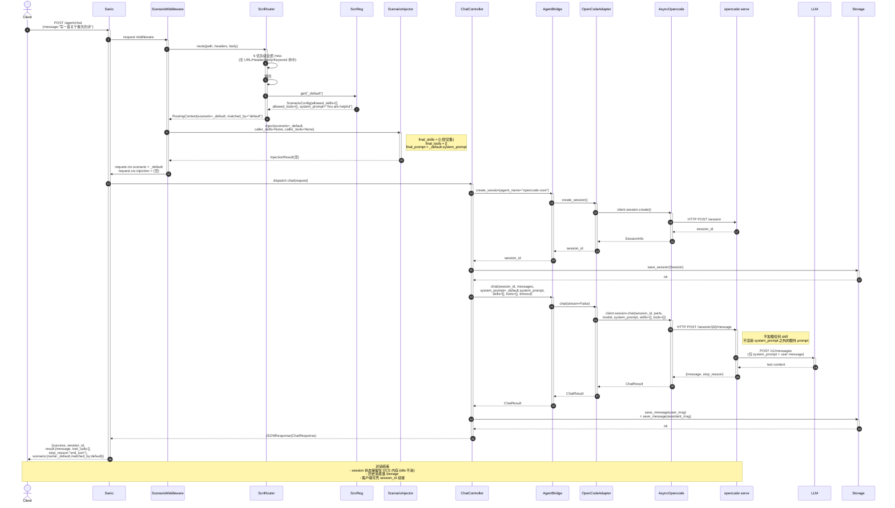
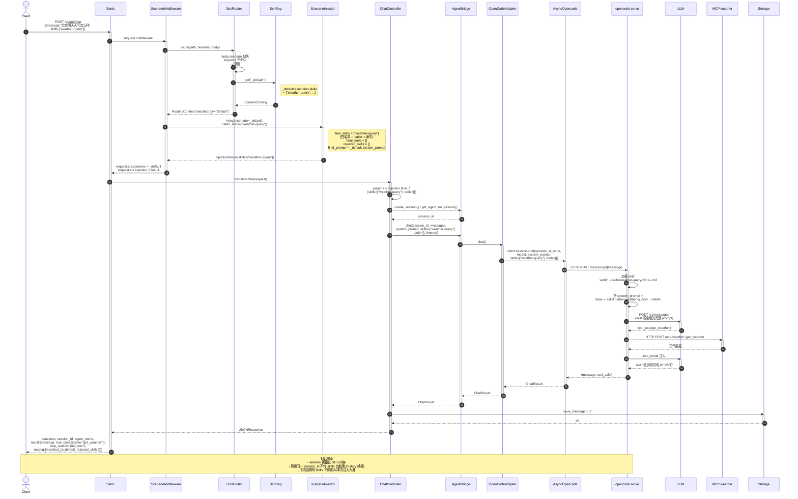

# OpenAgent 对话时序图 — 服务启动 + 3 种对话形态

> **目的**: 用 4 张 mermaid `sequenceDiagram` 把当前 F2 (scenario) + F4 (HITL) 改造后的实际代码路径画清楚。
> 覆盖:
> 1. **服务启动** — 引擎层 (opencode serve) 先起,Hub 后起,scenario/skill/tool registry 全部就位
> 2. **场景对话** — Client 显式传 `body.scenario` (或 `X-Scenario` / URL),走完整 scenario + injection 链
> 3. **普通对话** — 不传 scenario,命中 `_default`,无 skill 无 tool,纯 LLM
> 4. **单独加载 skill 对话** — 不传 scenario,命中 `_default`,但 caller 显式传 `body.skills`,且 default 白名单允许
>
> 关联源码:
> - `src/openagent/api/app.py` — Sanic 入口 + middleware 注册
> - `src/openagent/api/lifecycle.py` — `startup()` / `shutdown()`
> - `src/openagent/api/scenario_lifecycle.py` — scenario 子系统初始化
> - `src/openagent/scenarios/middleware.py` — `ScenarioMiddleware`
> - `src/openagent/scenarios/router.py` — 6 优先级 `ScenarioRouter`
> - `src/openagent/scenarios/injector.py` — 白名单 `ScenarioInjector`
> - `src/openagent/api/controllers/chat_controller.py` — `POST /agent/chat` + `/agent/chat/stream`
> - `src/openagent/providers/agent_bridge.py` — `AgentBridge`
> - `src/openagent/providers/opencode_adapter.py` — `OpenCodeAdapter` (薄壳)
> - `src/openagent/providers/opencode_chat.py` — `blocking_chat` / `stream_chat`
> - `src/openagent/core/scheduler.py` — `SchedulerService` (chat 任务编排)
> - `src/openagent/core/suspendable_scheduler.py` — `SuspendableScheduler` (HITL)
> - `src/openagent/core/turn_store.py` — `InMemoryTurnStore`
> - `src/openagent/providers/launcher.py` — `opencode serve` 进程生命周期

---

## 0. 组件与层对照

| 简称 | 实际类 / 模块 | 层 | 职责 |
|---|---|---|---|
| **Launcher** | `providers/launcher.py` | L4 | 拉起 `opencode serve` 进程 (Popen) |
| **OCS** | `opencode serve` (外部进程) | L4 | opencode 引擎 HTTP 入口 (:8080) |
| **Sanic** | `api/app.py` | L1 | 路由 + middleware 链 |
| **ScnMW** | `scenarios/middleware.py` | L1 | 拦截 `/agent/chat*` → 路由 + 注入 |
| **ScnRouter** | `scenarios/router.py` | L2 | 6 优先级路由 (URL>Header>Body>Keyword>Intent>Default) |
| **ScnReg** | `scenarios/registry.py` | L2 | 加载 `work/scenarios/*.scenario.yaml` |
| **ScnInj** | `scenarios/injector.py` | L2 | 白名单过滤 + 拼 system_prompt |
| **ChatCtrl** | `api/controllers/chat_controller.py` | L1 | `POST /agent/chat` + `/agent/chat/stream` |
| **Bridge** | `providers/agent_bridge.py` | L3 | 路由到正确 SDK 适配器 + session→agent 反查 |
| **Adapter** | `providers/opencode_adapter.py` | L3 | OpenCode 薄壳 (chat 委托给 `opencode_chat.py`) |
| **SDK** | `opencode_ai.AsyncOpencode` | L3 | opencode HTTP 客户端 |
| **Scheduler** | `core/scheduler.py` | L3 | 任务编排 (超时/重试) — 已被 ChatCtrl 直调 |
| **SuspendSch** | `core/suspendable_scheduler.py` | L3 | HITL 调度 (turn 状态机) |
| **TurnStore** | `core/turn_store.py` | L3 | 挂起 turn 持久化 (in-mem) |
| **Storage** | `store/*` (SessionRepository) | L3 | session + message 持久化 |
| **SkillReg** | `skills/registry.py` | L3 | `.skills/**/*.md` 元数据 |
| **MCPReg** | `mcp/registry.py` | L3 | MCP 工具元数据 |
| **LLM** | 外部 (anthropic / openai / ...) | - | LLM API |
| **MCP** | 外部 (flight / weather / ...) | - | MCP tool 端点 |

---

## 1. 服务启动 (Service Startup)

**关键点**:
- 引擎层 (Phase A) **必须先于** Hub (Phase B) 起;否则 `bridge.register("opencode-core")` 会注册失败
- `ScenarioRegistry` 启动时**只读** `work/scenarios/*.yaml`,运行时改 YAML → 调 `POST /agent/scenarios/reload` 热重载
- `TurnStore` 走 `InMemoryTurnStore` (F4 简化版),重启丢;Phase 5 评估持久化

---

## 2. 场景对话 (Scenario Conversation)

> **示例**: Client 发 `POST /agent/chat` `body.scenario = "flight_booking"`,session 已在,scenario 是 HITL 编排 (走 SuspendableScheduler)

**关键点**:
- 场景对话的 skill 列表**只来自 scenario 自己的 `execution.skills` 白名单** (与 caller 传入的 `body.skills` 取交集)
- HITL 模式下,**turn 状态独立于 session**:session 在 OCS,turn 在 TurnStore
- `suspend` 后客户端必须调 `POST /turn/{id}/resume` (见 `turn_routes.py:166`)

---

## 3. 普通对话 (Normal Conversation)

> **示例**: Client 发 `POST /agent/chat` **不传** `scenario` / `skills` / `tools`,命中 `_default` (allowed_skills/tools 为空),纯 LLM 调

**关键点**:
- 普通对话**不是"绕过 scenario"**——它**也走 middleware**,只是命中 default scenario
- 想要真正的"裸 LLM"必须有一个 `_default` scenario 且 `allowed_skills=[]`、`allowed_tools=[]`
- `_default` 缺失时 `route()` 抛 `RoutingFailedError` → controller 返回 400 (设计如此,防止裸奔)

---

## 4. 单独加载 skill 对话 (Standalone Skill Conversation)

> **示例**: Client 发 `POST /agent/chat` **不传** `scenario`,但显式传 `body.skills=["weather-query"]`,命中 `_default` (其白名单允许 weather-query),tool 不传

**关键点**:
- "单独加载 skill" 跟"普通对话"差别**只在 caller 传了 `body.skills`**:让 `_default` 的白名单生效
- `rejected_skills` 字段会回传给 client,方便排查"我传了但没生效"的问题
- **没有 scenario ≠ 绕过注入**:即便走 default,middleware 仍跑、Injector 仍过滤

---

## 5. 3 种对话的差异对照

| 维度 | 场景对话 | 普通对话 | 单独加载 skill |
|---|---|---|---|
| `body.scenario` | 显式传 | 不传 | 不传 |
| `body.skills` | 可选(白名单内) | 不传 | 显式传 |
| ScnRouter 命中 | URL/Header/Body/Keyword (前 5 优先级) | default (第 6) | default (第 6) |
| `matched_by` 字段 | `body` / `header` / `url` / `keyword` | `default` | `default` |
| `injection.final_skills` | scenario 白名单 ∩ caller | `[]` (default 为空) | caller (若 default 允许) |
| `injection.final_system_prompt` | scenario.system_prompt + caller | default.system_prompt | default.system_prompt |
| 是否可走 HITL | ✅ (orchestration=hitl) | ❌ (default 通常 single) | ❌ |
| Turn 是否进 TurnStore | ✅ (HITL) 或 ❌ (single) | ❌ | ❌ |
| OCS 是否加载 skill | ✅ (scenario / caller 列表) | ❌ | ✅ (caller 列表) |
| MCP tool 是否可达 | ✅ (scenario 允许) | ❌ | ❌ (除非 default 允许) |
| `rejected_skills` 字段 | 可能有 (caller 超白名单) | `[]` | 可能有 (caller 超 default 白名单) |

---

## 6. 对话"结束"的状态留痕

| 结束方式 | 状态落在哪 | 续接方式 |
|---|---|---|
| **普通场景对话 (single)** | session 在 OCS 内存 + Storage | 凭 `session_id` 续发即可,SDK 自动 resume |
| **HITL 场景对话 (suspend)** | turn 在 TurnStore (F4 简化:in-mem), session 在 OCS | 客户端调 `POST /turn/{id}/resume` (body: form 填写结果) |
| **普通对话 / 单独 skill** | session 在 OCS 内存 + Storage | 凭 `session_id` 续发 |
| **任何 chat 中途出错** | error event 推 SSE / JSON `error` 字段 | 客户端重试,需要的话带新 session_id |
| **Server shutdown** | session 状态**丢失** (OCS 内存) | 客户端需建新 session;Storage 里的 message 历史仍在,UI 可拼回 |

---

## 7. 错误流的统一出口

| 错误源 | 表现 | 客户端看到 |
|---|---|---|
| `ScenarioMiddleware.route()` 抛 `RoutingFailedError` | `request.ctx.scenario_error = e` | `chat`: 400 JSON `{success:false, code:"ROUTING_FAILED", error:..., action:...}` `chat_stream`: SSE `error` 事件后 eof |
| `ScenarioInjector.inject()` 失败 | 同上,挂 `INJECTION_FAILED` | 同上 |
| `bridge.create_session()` 失败 | controller catch | 500 JSON,`error: "TypeError: ... [traceback]"` |
| `OCS` HTTP 5xx / 超时 | adapter raise | controller catch → 500 JSON / SSE `error` |
| LLM API 4xx/5xx | opencode serve 返回 error | result.error 字段填充,success=false |
| HITL 状态机走错 | SuspendableScheduler emit `TurnEvent(ERROR)` | SSE `error` 事件 |

---

## 8. 验证清单 (用这些图查实现)

- [ ] 启动顺序:launcher 拉 OCS 在前,Hub 在后,否则 `opencode-core` 注册失败
- [ ] middleware **只拦截** `/agent/chat` + `/agent/chat/stream` + `/agent/scenarios/{name}/chat`,其他 URL 不动
- [ ] 场景对话的 `matched_by` 跟路由优先级一致 (URL > Header > Body > Keyword > Intent > Default)
- [ ] 普通对话 / 单独 skill **仍走** middleware (只是命中 default)
- [ ] `_default` 缺失时 `chat` 必返回 400,不会"裸奔"调 LLM
- [ ] `final_skills` = 交集,`rejected_skills` 必有值或空数组
- [ ] HITL 模式下,SSE 流里**必有** `scenario` → `session` → `card` → `suspend` 序列,然后停
- [ ] 单步场景 SSE 流:**有** `scenario` → `session` → `text/tool_use/tool_result` → `done`
- [ ] session 状态在 OCS 内存,关 OCS 进程就丢;Storage 里的 message 历史独立保留
