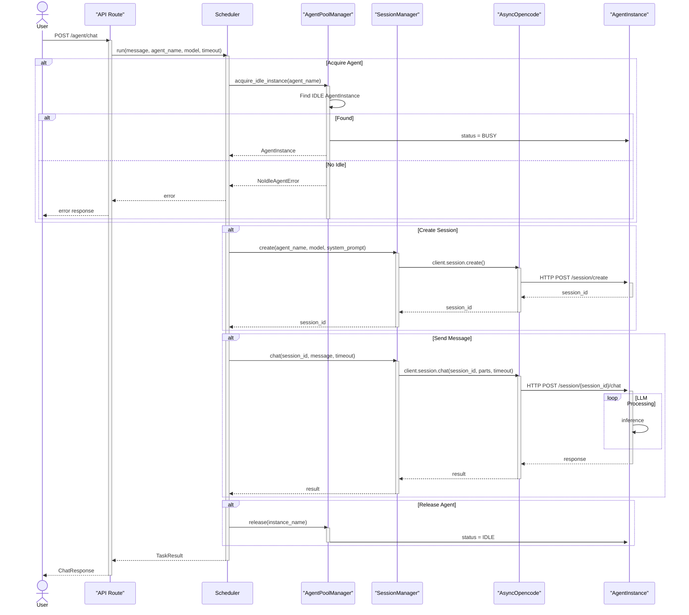
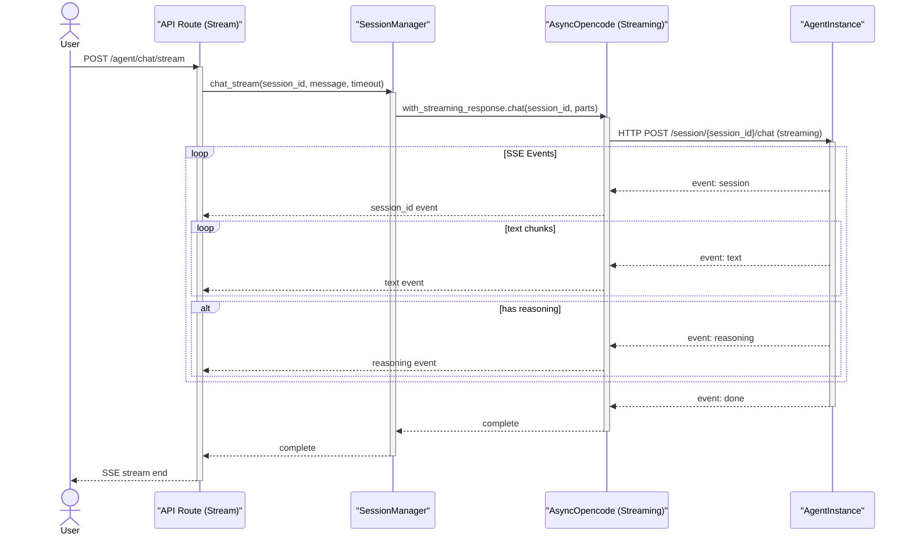
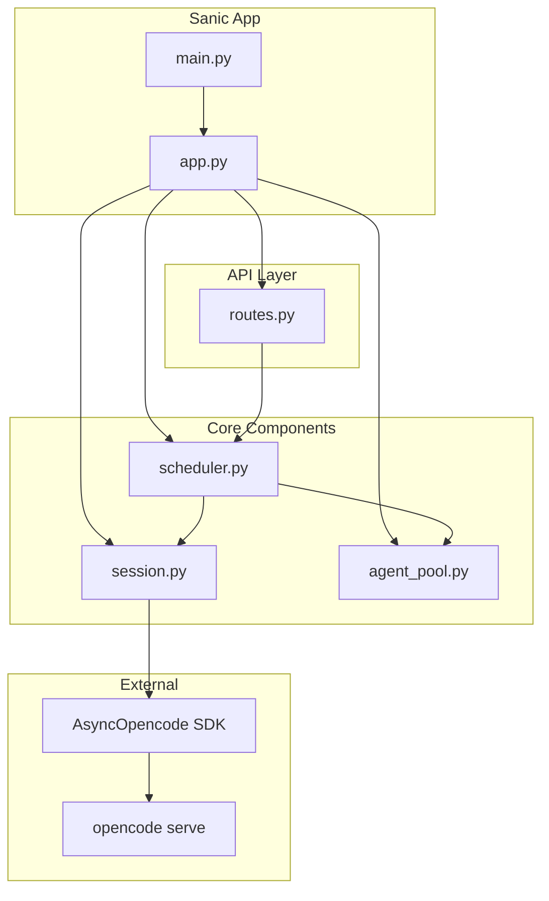
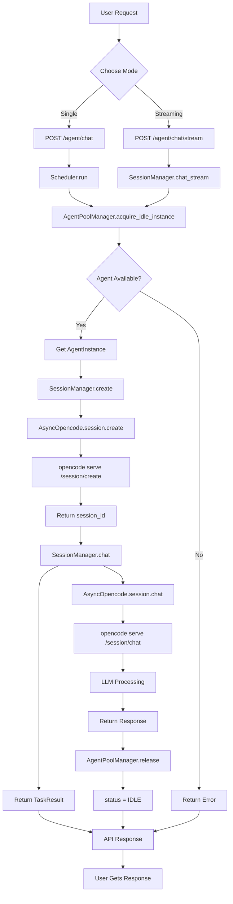

# OpenCode 对话流程时序图

> **⚠️ 已废弃（2026-06-05）**
>
> 本文档对应的是 **Scenario 编排层接入前** 的旧版流程（仅含 `Scheduler` + `AgentPool` + `SessionManager`）。
> 不再反映当前架构 — 当前架构在 5 层框架下增加了：
> - L2 `ScenarioMiddleware` + `ScenarioRouter` + `ScenarioInjector` + `SchedulerAdapter`
> - L3 `SuspendableScheduler`（HITL 中断/恢复）+ `skill_runtime` + `auip` + `turn_store`
> - L4 `EngineLauncher`（`cwd = ${PROJECT_DIR}` 强制）
> - 统一 chat 入口（仅 `POST /agent/chat` 与 `/agent/chat/stream`）
>
> **最新文档** → [`docs/architecture-and-flow.md`](./architecture-and-flow.md)
> **历史归档** → 保留本文作 2026-05 版本参考，不要再基于此文档做新设计。
>
> ---

# OpenCode 对话流程时序图（旧版，仅供历史）

## 1. 主对话流程

## 2. 流式对话流程

## 3. 核心组件架构

## 4. 完整流程图

