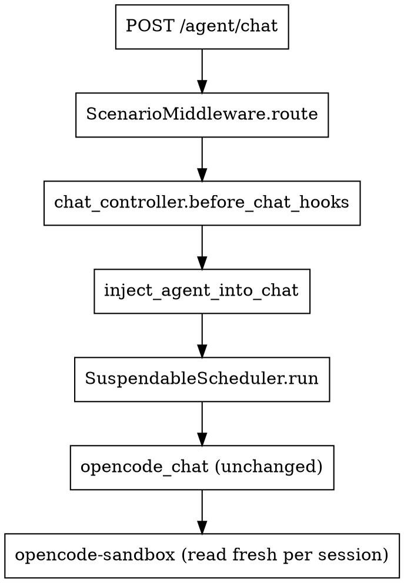

# Dynamic Asset Registry (Agents / Skills / MCP / Prompts / Commands)

> Mini-spec: turn `hermetic-agent` into a LLM asset control-plane — DB-backed
> registration of the 5 resource types (MCP server, skill, prompt, command, agent),
> skill files in MinIO, hot-injection into the opencode sandbox without rebuilding
> the container.

- **Date**: 2026-06-30
- **Status**: Draft (pending user review)
- **Scope**: backend + Docker compose + frontend stub routes; no admin UI.

---

## 1. Goals (recap from brainstorm)

1. Register MCP / skills / agents / prompts / commands quickly via REST, persist to DB.
2. Each user/owner has private assets; opt-in publish to community (owner-private default, public toggle).
3. Skill files (multi-file bundle: `SKILL.md`, `scripts/`, `assets/`) stored in MinIO; metadata in DB.
4. Other 4 asset types stored only in DB (text/JSON).
5. **"No rebuild"** — newly registered assets must reach the opencode sandbox without `docker compose build` / `docker compose restart`.
6. Stay within existing 5-layer architecture (`AGENTS.md`); zero signature change to `mcp/registry.py`, `skills/registry.py`, `providers/*`, `core/scheduler.py`.

**Not this round**: full admin UI, multi-tenant isolation, Nacos extension, asset search, asset version rollback.

---

## 2. Architecture (chosen: A — Per-session asset rendering)

```
client ──REST──> Hub (Sanic, L1 controllers)
                  │
                  ├─ L1 API: write endpoints       ──>  Service layer (L5 store)
                  ├─ L1 API: read endpoints        ──>  Service layer
                  │
                  └─ chat hook (chat_inject/) ──> AgentResolver ──> ResolvedAsset bundle
                                                        │
                                                        ├─ AssetRenderer (in-memory)
                                                        ├─ OverlayBuilder (writes MinIO blobs to host staging)
                                                        └─ SkillOverlayManager (admin API: /admin/policy + /admin/reload)

Resolved assets injected into existing chat flow via:
  - ScenarioMiddleware (unchanged)  ─> scenario-level routing still applies
  - AgentInjector (new)             ─> augments system_prompt, mcp_servers,
                                        skill_paths in per-chat config.json,
                                        and triggers /admin/reload lazily

opencode-sandbox ──(per-chat config.json + admin/policy reload)──> reads:
  - skills.paths        from admin-written policy.runtime overlay
  - mcp.*               from per-chat config.json (regenerated each chat)
  - system prompt       from Hub-rendered text sent over the wire
```

**Why lazy / per-fingerprint reload** (not per-session overlay — see brainstorm session §4):
- One opencode process serves many sessions per node. We cannot bind-mount per-session `skills.paths` into a shared process.
- Mitigation: cache `(node_id, skills_fingerprint)` → opencode is reloaded only when the fingerprint changes. Steady-state: zero reloads. Adding a new skill: exactly one reload (≈ 1 second SIGTERM supervisor cycle).
- Per-chat regen of `config.json` (already done by `_render_opencode_config`) handles MCP servers, system prompt augmentation, etc. — no reload needed for those.
- Why this satisfies "no rebuild": `docker compose build` and `docker compose restart` are both avoided. SIGTERM-restart of the opencode process inside the running container is invisible to users and never requires rebuilding / recreating the container.

---

## 3. Data model

### 3.1 Tables (Tortoise)

5 tables; one column-set reused:

| Column | Type | Notes |
|---|---|---|
| `id` | `UUIDField(pk=True)` | |
| `code` | `CharField(unique=True, max_length=128)` | business identifier (e.g. `flight-query`) |
| `name` | `CharField(max_length=255)` | human-readable |
| `version` | `IntField(default=1)` | future-proof; not used this round |
| `description` | `TextField(null=True)` | |
| `owner_user_id` | `CharField(max_length=128, default="anonymous", index=True)` | who created it |
| `visibility` | `CharField(max_length=16, default="private", index=True)` | `private` \| `public` |
| `status` | `CharField(max_length=32, default="enabled")` | `enabled` \| `disabled` \| `draft` |
| `is_deleted` | `BooleanField(default=False, index=True)` | soft-delete |
| `deleted_at` | `DatetimeField(null=True)` | |
| `created_at` / `updated_at` | auto | |

Index `(owner_user_id, visibility, is_deleted)` covers `list_mine() + list_public()` query.

### 3.2 Per-table extra columns

**`mcp_configs`** (existing, **extend**)
- `mcp_type`, `url`, `command`, `args`, `env`, `cwd`, `headers`, `allowed_tools`,
  `disabled`, `config`, `source`, `status` (existing)
- **new**: `owner_user_id`, `visibility`

**`skills`** (existing, **extend**)
- `description`, `triggers`, `input_schema`, `output_schema`, `prompt_template`,
  `mcp_tools`, `required_envs`, `config`, `source`, `status` (existing)
- **new**: `owner_user_id`, `visibility`, `file_count`, `file_fingerprint` (sha1 of all etags)

**`prompts`** (new)
- `content TextField` — the prompt template body

**`commands`** (new)
- `slash_command CharField(unique_with_code=True, max_length=64)` — e.g. `/summarize`
- `system_prompt_addendum TextField` — text appended to chat system_prompt explaining the command
- `enabled` bool

**`agents`** (new, composite)
- `system_prompt TextField`
- `model CharField` — e.g. `openai/gpt-4o-mini`
- `tool_level CharField` — `safe` \| `standard` \| `full`
- `network CharField` — `off` \| `local` \| `any`
- `skill_codes JSONField` — list of `Skill.code` references
- `mcp_server_codes JSONField`
- `prompt_codes JSONField`
- `command_codes JSONField`

**Cascade policy (chosen)**: soft-delete does NOT cascade. References persist; missing assets are filtered out at chat time and a warning is recorded in `chat_turn.warning` (new field on existing `ChatTurn` model — guarded by `try/except` so old rows don't crash).

### 3.3 Memory backend parity

Each new table + repo has both `Memory*Repository` (lists in-process dict) and `MySQL*Repository` (Tortoise queries). Pattern matches existing `SkillRepository` / `McpConfigRepository`. Service layer uses interface (`Repository` ABC) — controller can't tell the difference.

---

## 4. REST surface

All endpoints under `/agent/*` prefix. New blueprints:

```
agent_bp           Blueprint("agents",   url_prefix="/agent/agents")
prompt_bp          Blueprint("prompts",  url_prefix="/agent/prompts")
command_bp         Blueprint("commands", url_prefix="/agent/commands")
skill_files_bp     Blueprint("skill_files", url_prefix="/agent/skills")
```

Each of `agent_bp` / `prompt_bp` / `command_bp` registers the same 7 routes:

| Method | Path | Purpose |
|---|---|---|
| `GET` | `/` | List (own ∪ public, paginated via `limit`/`offset`) |
| `GET` | `/community` | List public only (no auth required) |
| `GET` | `/<code>` | Get one (owner private OR public) |
| `POST` | `/` | Create (sets `owner_user_id` from actor) |
| `PUT` | `/<code>` | Update (owner-only) |
| `DELETE` | `/<code>` | Soft-delete (owner-only) |
| `POST` | `/<code>/publish` | Toggle visibility (owner-only) |

Reuses existing patterns: `mcp_controller.py` and `skill_controller.py` are templates; new controllers copy their structure (one helper `_get_container`, one `_err(code, message, status)`, one shared DTO `Create*Request` / `Update*Request`).

### 4.1 Skill files subroutes (`skill_files_bp`)

| Method | Path | Body |
|---|---|---|
| `GET` | `/<code>/files` | — |
| `GET` | `/<code>/files/<path:path>` | — |
| `PUT` | `/<code>/files/<path:path>` | raw bytes (≤ 16 MB; 413 otherwise) |
| `DELETE` | `/<code>/files/<path:path>` | — |
| `POST` | `/<code>/files:batch` | `{files:[{path, content_b64}]}` (≤ 8 files / call) |

Path-traversal protection single-source-of-truth inside `SkillFilesClient` (rejects `..`, leading `/`, backslashes, `\x00`).

### 4.2 Actor resolution

New module: `api/http/middleware/actor_context.py` — `ActorContextMiddleware` reads:

1. `X-User-Id` header (primary).
2. Falls back to JWT subject from `Authorization: Bearer <jwt>` if present.
3. Falls back to `actor = ActorContext(user_id="anonymous")`.

Sets `request.ctx.actor = ActorContext(user_id, tenant_id?, roles?)`. Controllers read `request.ctx.actor.user_id` and pass into `service.create/update/publish/delete(actor_id=...)`.

### 4.3 Error codes (extension to existing 12)

- Reuse all 12 existing codes (`VALIDATION_FAILED`, `DUPLICATE_*`, `NOT_FOUND`, `FORBIDDEN`, …).
- Add 1 new code: `OBJECT_STORE_UNAVAILABLE` returned by skill-files endpoints when MinIO is unreachable. Documented in `docs/api.md §3.4`.

### 4.4 OpenAPI extensions

`sanic_ext.openapi.spec` amended with 4 new tags: `Agents`, `Prompts`, `Commands`, `Skill Files`. Each endpoint annotated with `doc_summary` / `doc_description` / `doc_tag` matching existing pattern.

---

## 5. MinIO service

### 5.1 Container

```yaml
# docker-compose.yml
minio:
  image: minio/minio:latest
  container_name: hermetic-agent-minio
  command: server /data --console-address ":9001"
  environment:
    MINIO_ROOT_USER: ${MINIO_ROOT_USER:-hermetic-agent-minio}
    MINIO_ROOT_PASSWORD: ${MINIO_ROOT_PASSWORD:-minio-secret-dev}
  ports:
    - "${MINIO_API_PORT:-9000}:9000"
    - "${MINIO_CONSOLE_PORT:-9001}:9001"   # dev / debug; comment in prod
  volumes: [minio-data:/data]
  networks: [sandbox-net]
  healthcheck:
    test: ["CMD", "curl", "-fsS", "http://127.0.0.1:9000/minio/health/ready"]
    interval: 10s
    timeout: 5s
    retries: 5
volumes:
  minio-data:
```

A `minio-init` sidecar (or folded into `hermetic-agent` startup) creates `hermetic-agent-skills` bucket + read-only service account. Idempotent.

### 5.2 Client library (`store/object/`)

| File | LOC | Responsibility |
|---|---|---|
| `minio_client.py` | ≤ 200 | minio-py SDK wrapper; `get_object`, `put_object`, `delete_object`, `list_objects`, `bucket_exists`, `ensure_bucket`. Reads `minio_*` settings. |
| `skill_files.py` | ≤ 200 | Domain layout `bucket=hermetic-agent-skills`, `key=skills/{code}/{path}`. Path-traversal validator. Public surface: `upload_file / download_file / delete_file / list_files / sync_to_dir`. |
| `memory_skill_files.py` | ≤ 200 | For dev (`AGENT_SCHEDULER_ASSET_BACKEND=memory`); same interface; stores blobs in `work/cache/_memory-skill-files/{code}/{path}`. |

Interface selection happens at `startup` via `build_asset_clients(settings)` returning `(skill_files_client,)`.

### 5.3 Settings (§16 MinIO)

```
minio_endpoint          = "minio:9000"               # host:port, NO scheme
minio_secure            = False                      # True in prod (TLS)
minio_access_key        = "hermetic-agent-hub"
minio_secret_key        = "<from-secret>"
minio_bucket_skills     = "hermetic-agent-skills"
minio_connect_timeout   = 5.0
minio_request_timeout   = 30.0
```

### 5.4 Path validation rules

`path` must match `^[\w\-./]+$` (no `..`, no leading `/`, no backslash, no `\x00`). Reject otherwise — single check in `SkillFilesClient`.

### 5.5 Failure mode

MinIO unreachable → write APIs return `OBJECT_STORE_UNAVAILABLE`. Chat-side reads (overlay builder, asset renderer) log warning + skip missing assets. **Hub never crashes on MinIO outage.** Tests cover both branches.

---

## 6. Hot-inject mechanism (no rebuild)

### 6.1 What gets reloaded when what changes

| Asset mutation | Chat-side impact | Sandbox reload? |
|---|---|---|
| New agent / agent updated | Augmented system prompt + mcp block in next per-chat config.json | **No** — `config.json` regenerated per chat already |
| New prompt / command (DB) | Concatenated into system prompt on next chat | **No** |
| New MCP server in DB | `config.json[mcp]` block on next chat | **No** |
| New skill in DB | Skill content must reach opencode process | **Yes, once per (node, skills_fingerprint)** via `/admin/policy` + `/admin/reload` |
| New/edited skill file in MinIO | Same as above; re-syncs overlay dir then re-renders `config.json` + reload | **Yes, once per (node, fingerprint)** |

### 6.2 `chat_inject/` package (new)

```
src/hermetic_agent/chat_inject/
├── __init__.py
├── agent_resolver.py          (≤ 200 LOC)
├── overlay_builder.py         (≤ 200 LOC)
├── asset_renderer.py          (≤ 250 LOC)  L3
├── skill_overlay_manager.py   (≤ 200 LOC)
├── injector_adapter.py        (≤ 200 LOC)  the chat hook
└── reload_queue.py            (≤ 200 LOC)  per-node fingerprint → /admin/reload state
```

### 6.3 Two extension points

**(a)** Opencode `admin_server.py` extension — **one new endpoint added to the existing admin API**:

```
POST /admin/policy — existing, accept NEW sub-keys:
  - skills.paths           list[string]
  - policy.policy_version  (existing)
```

`render_config.py` already honors `policy.skills` (top-level list) via `_build_skills_block`. We just ensure Hub writes `skills.paths` (the opencode v1 key) into the policy overlay too. Bumping `policy_version` triggers `_render_config` to regen `config.json` and the supervisor restarts opencode.

**(b)** `chat_controller.py` integration — **no signature change to existing handlers**; we add a `before_chat` hook list:

```python
# in chat_controller.py (only addition: 4 lines)
_BEFORE_CHAT_HOOKS = [
    "scenarios.middleware.ScenarioMiddleware.attach",  # existing
    "chat_inject.injector_adapter.inject_agent_into_chat",  # NEW
]
```

The hook signature `(request, chat_request) -> chat_request` keeps the calling code untouched.

### 6.4 Per-session asset rendering

`AssetRenderer.render_opencode_mcp_block(resolved_agent, db_mcp_list) -> dict[str, dict]` — produces the `mcp` block that `_render_opencode_config` writes. The launcher already merges `security["mcp_servers"]`; we extend that path by introducing an optional `extra_opencode_mcp` dict on the chat request.

### 6.5 Fingerprint caching

`SkillOverlayManager` keeps an in-memory `dict[node_id, last_seen_fingerprint]`. When `effective_skills_fingerprint` (computed from sorted file etags) for a chat differs from cached → enqueue a `ReloadTask(node_id, paths)` to a single-consumer worker task (started in `lifecycle.startup`).

Worker task:

```python
async def _reload_worker(self):
    while True:
        task = await self._queue.get()
        await self._apply_relaxed(task)   # debounce 10s
async def _apply_relaxed(self, task):
    # 1. POST /admin/policy { "skills": { "paths": [...] } }   (existing endpoint)
    # 2. POST /admin/reload                                   (existing endpoint)
```

### 6.6 Lazy / once-per-fingerprint guarantee

- First chat referencing a new skill fingerprint → 1× reload (≈ 1s SIGTERM gap).
- Next N chats with same fingerprint → no reload.
- Skill edit (file change) → new fingerprint → 1× reload on next chat.
- Pre-validation: `reload_worker` skips if `(node_id, fingerprint, paths)` already enqueued within last 10s.

---

## 7. Chat flow integration



`inject_agent_into_chat` does, in order:

1. Read `actor = request.ctx.actor`.
2. Resolve `agent_code` via priority: `body.agent_code` → `X-Agent-Code` header → `scenario_yaml.agent_code` → settings default.
3. `AgentResolver.resolve(agent_code, actor.user_id) -> ResolvedAgent` (filters missing refs).
4. `AssetRenderer.render_system_prompt(resolved_agent, db_prompts, db_commands)` → written to `chat_request.system_prompt` (preserving existing `ScenarioInjector` precedence: scenario → agent → prompts → commands).
5. `AssetRenderer.render_opencode_mcp_block(resolved_agent, db_mcp_list)` → `chat_request.extra_opencode_mcp`.
6. `SkillOverlayManager.ensure_active(skill_codes, db_skills)` — if fingerprint changed → enqueue reload task; return current `(skills.paths)` list.
7. Persist `Session.effective_*_snapshot` for audit.

All writes go through `service.<x>.update(actor_id=...)` so audit log captures actor.

---

## 8. Frontend (stub only)

```
frontend/src/services/agents.ts           API client
frontend/src/services/prompts.ts          API client
frontend/src/services/commands.ts         API client
frontend/src/services/skill_files.ts      API client
frontend/src/types/assets.ts              TS types matching REST shape
frontend/src/routes/admin/assets.tsx      placeholder "Assets" route
frontend/src/App.tsx                      add nav link "Assets"
frontend/src/services/__tests__/agents.test.ts  smoke (optional, time permitting)
```

`curl` examples go into `docs/api.md §6.4`.

---

## 9. Settings additions to `config/settings.py`

```python
# §16 MinIO
minio_endpoint: str = "minio:9000"
minio_secure: bool = False
minio_access_key: str = "hermetic-agent-hub"
minio_secret_key: str = "change-me"
minio_bucket_skills: str = "hermetic-agent-skills"
minio_connect_timeout: float = 5.0
minio_request_timeout: float = 30.0
asset_backend: str = "minio"   # or "memory"

# §17 Agent Defaults
agent_default_code: str = "general-assistant"
agent_default_model: str = "openai/gpt-4o-mini"
agent_default_tool_level: str = "standard"
agent_default_visibility: str = "private"
agent_enabled: bool = True     # master toggle (default off in prod until validated)
```

---

## 10. New errors added to the 12-code table

Code table from `docs/architecture-and-flow.md §7`. We add **one** new code:

| code | When |
|---|---|
| `OBJECT_STORE_UNAVAILABLE` | Skill-files write/read attempted while MinIO is unreachable |

---

## 11. Rollout plan

Per-`AGENTS.md §8` all changes are **new files** with **zero signature change** to existing modules.

| Phase | Scope | Verification |
|---|---|---|
| 1 | DB + REST data plane (5 tables, services, controllers, DTO, actor middleware) | `curl POST/GET` per endpoint, ROUND-TRIP DB; existing chat flow unchanged |
| 2 | MinIO + `store/object/` + skill_files_controller | `curl PUT/GET file`, MinIO console shows object; existing chat flow unchanged |
| 3 | `chat_inject/agent_resolver` + `asset_renderer` | unit tests; integration test: POST `/agent/chat` with private agent returns augmented system prompt |
| 4 | `chat_inject/skill_overlay_manager` + reload worker | integration test: POST skill file → next chat sees it after ≤1 reload |
| 5 | Frontend stubs | `pnpm tsc --noEmit` passes; manual `curl` walk through `docs/api.md §6.4` |
| 6 | docker-compose + `minio-init` + restart verification | `docker compose up -d --build`; observe minio healthy; integration test pass |

Master switch `agent_enabled=False` in `.env.example` defaults until phase 4+ validated.

---

## 12. Risk register

1. **MinIO under-provisioned**: uploads time out. **Mitigation**: degrade — write returns `OBJECT_STORE_UNAVAILABLE`; chat-side reads log warning + skip missing assets.
2. **Per-fingerprint reload thrash** (rapid edits). **Mitigation**: 10s debounce in `_reload_worker`.
3. **system_prompt precedence ambiguity**: scenario vs agent vs DB-prompts. **Documented in §7 step 4** — fixed order.
4. **`extra_opencode_mcp` not honored by launcher**: mitigation: extend `_render_opencode_config` to read `chat_request.extra_opencode_mcp` if present (5 LOC, no signature change since it's an optional kwarg passed through `scenario_security` already).
5. **Soft-deleted referenced asset in agent**: filtered at resolve; warning recorded.

---

## 13. Out of scope (YAGNI)

- Admin UI components.
- Multi-tenant data plane (only per-user).
- Nacos sync extension (`NacosAISync` remains stub).
- Versioning UI / rollback.
- Full-text search.
- Asset import/export from external registries (LiteLLM, Nacos).
- Auth provider integration (we read X-User-Id header; real auth is a separate project).
